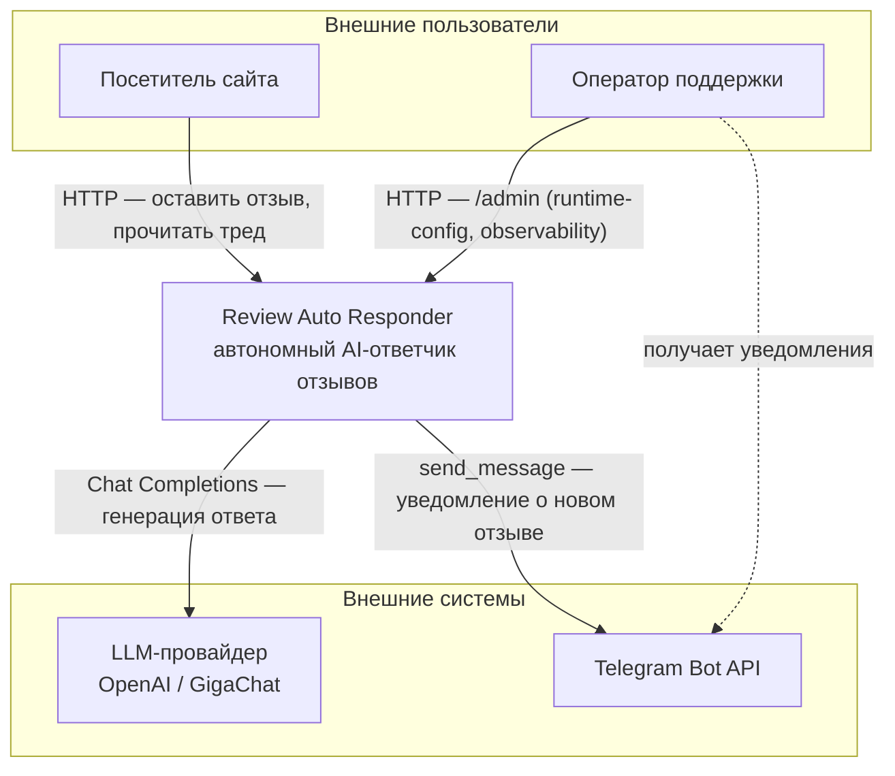
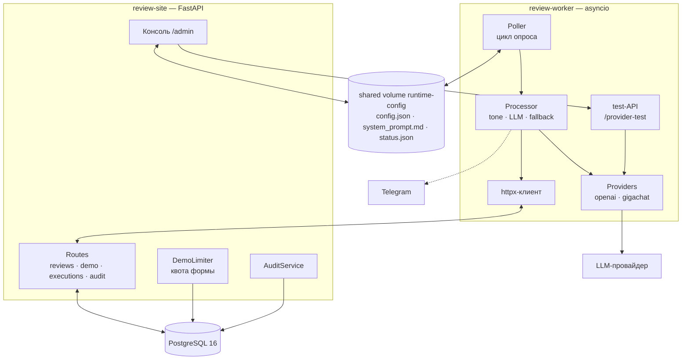
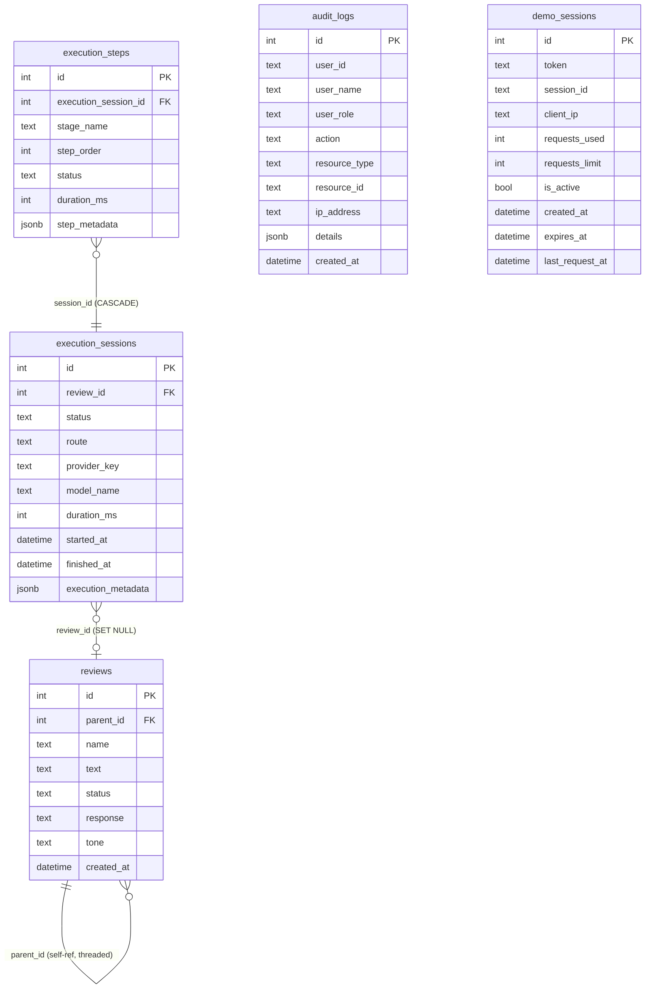
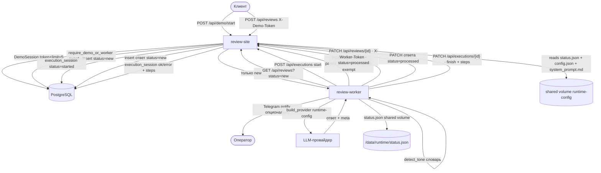
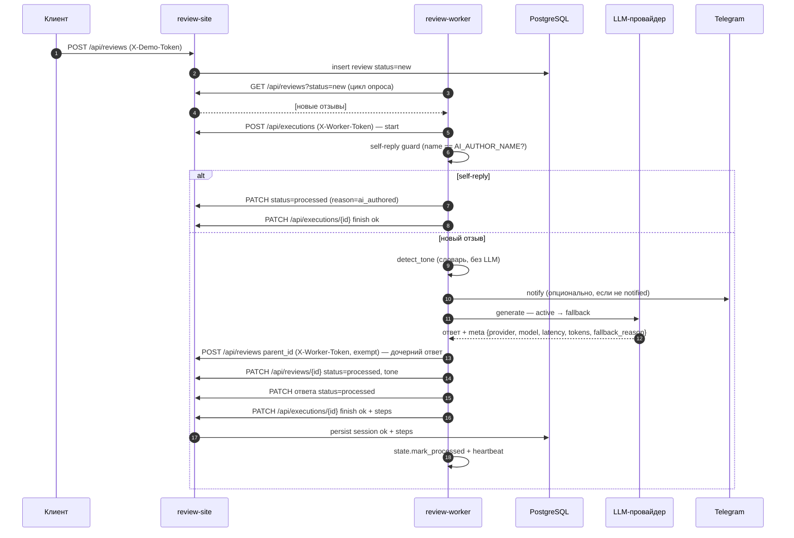
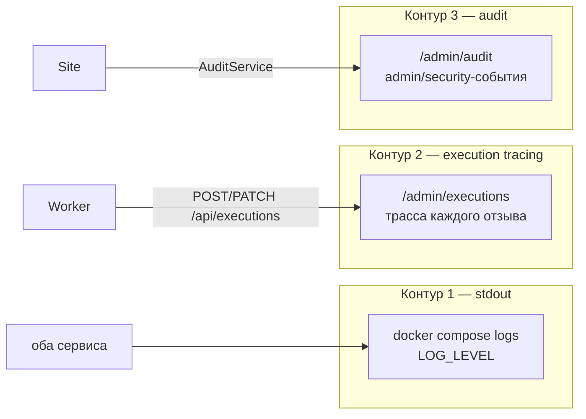
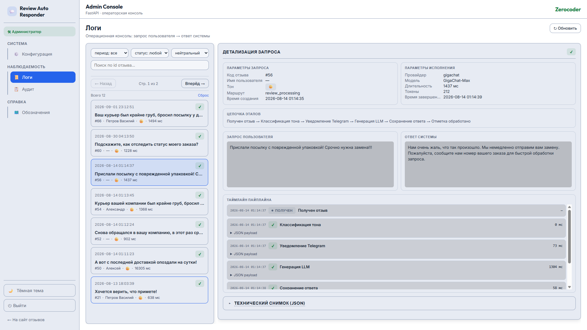
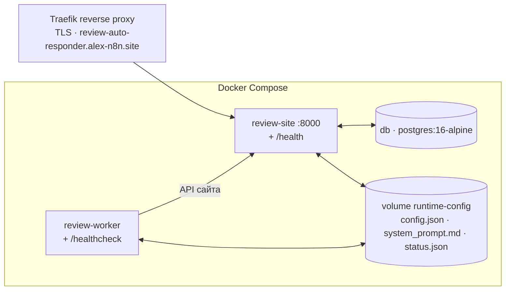

# 🏗️ ARCHITECTURE.md — Review Auto Responder

**Проект:** review-auto-responder
**Дата:** 2026-08-14
**Статус:** Engineering Layer — архитектура и путь данных.

---

## 🎯 1. Архитектурные принципы

| Принцип | Суть |
|---------|------|
| **Разделение хранения и обработки** | `review-site` (FastAPI + PostgreSQL) — хранение, UX, `/admin`; `review-worker` (asyncio) — автономная обработка. Сайт не знает про LLM, воркер не имеет БД-сессии. |
| **Сайт — первичный SOT статуса** | `reviews.status` (`new`/`processed`) — истина; локальный `state.json` воркера — вторичный идемпотентный guard на окно «обработал, но сайт ещё не подтвердил». |
| **Секреты отдельно от runtime** | API-ключи — только `.env` (рестарт); операторские параметры и промпт — `config.json`/`system_prompt.md` на shared volume (без рестарта). Ключи никогда не попадают в `/admin`/браузер/config.json. |
| **Fallback-by-design** | active LLM → fallback LLM → словарные шаблоны по тону. Система отвечает даже без LLM-ключей. |
| **Observability — три контура** | stdout-логи · execution-трейсы (БД) · журнал аудита (БД). Каждый со своим носителем и зоной. |
| **Hot-reload по mtime** | `config.json` и `system_prompt.md` кешируются по `st_mtime`; смена провайдера/модели/промпта через `/admin` применяется на следующем цикле опроса без рестарта. |

---

## 🌐 2. Context Diagram (C4 Level 1)

Система в окружении — кто с ней взаимодействует и какие внешние системы задействованы.

- **Посетитель** — анонимный, без регистрации; оставляет отзыв и видит автономный
  AI-ответ в треде.
- **Оператор** — входит в `/admin` (полный токен или демо-режим) и параллельно
  получает Telegram-уведомления о негативе.
- **LLM** — OpenAI или GigaChat через единую абстракцию Chat Completions.
- **Telegram** — опциональный канал уведомления оператора.

---

## 📦 3. Container Diagram (C4 Level 2)

Внутреннее устройство: два сервиса, БД, shared volume и их связи.

- **`review-site`** — первичный SOT: хранит отзывы, публичный UI, `/admin`, демо-лимиттер,
  аудит. LLM-ключей нет.
- **`review-worker`** — автономный поллер: опрашивает только `status=new`; processor
  определяет тон (словарь), генерирует ответ (LLM active→fallback), пишет ответ обратно
  как дочерний комментарий, уведомляет в Telegram. Ключи живут **только** на воркере.
- **shared volume** — мост сайт↔воркер без HTTP: `/admin` **пишет** `config.json` +
  `system_prompt.md` и **читает** `status.json`; воркер **читает** config/промпт по mtime
  и **пишет** `status.json` (liveness + bool-флаги провайдеров, без секретов).
- **test-API** (`worker/api.py`) — внутренний порт `WORKER_API_PORT` (**не публикуется на
  хост**), `POST /provider-test` защищён `X-Worker-Token`; кнопка «Проверить» идёт через
  site-proxy `/admin/test-provider` — ключи не покидают воркер.

---

## 🗂️ 4. Модель данных

Пять таблиц PostgreSQL (создаются `Base.metadata.create_all` в lifespan сайта,
Alembic не используется — idempotent для существующей БД демо) + локальный state воркера.

**Ключевые факты модели:**

- **`reviews` — threaded-структура.** Ответ воркера — это строка `reviews` с
  `parent_id = <id отзыва>`, `name = AI_AUTHOR_NAME`, `status = new` (дочерний
  комментарий). Дерево комментариев сайта сохраняется. `status` — **первичный SOT**
  обработанности; `tone` — `positive`/`negative`/`neutral` (определяет воркер).
- **`execution_sessions` / `execution_steps`** — контур execution-tracing. Двухфазная
  запись: `POST /api/executions` (start, `status=started`) → сбор шагов в памяти с
  `perf_counter`-таймингом → `PATCH /api/executions/{id}` (finish, шаги одним пакетом).
  Для `llm_call` `step_metadata` несёт `{provider, model, latency_ms, tokens, fallback_reason}`.
  При падении воркера остаётся `started`-сессия (диагностический признак зависшей обработки).
- **`audit_logs`** — контур аудита: кто/что/когда/откуда. `details` (JSONB) **без секретов
  и полных промптов** (только `prompt_len`, `prompt_changed`, `changed_keys`).
- **`demo_sessions` (v1.5)** — токенизированная демо-квота публичной формы. `token`
  выдаётся `POST /api/demo/start`, передаётся заголовком `X-Demo-Token`, хранится в
  `localStorage` посетителя. `requests_limit` = `DEMO_MAX_REQUESTS_PER_SESSION` (5);
  `expires_at` = `DEMO_SESSION_TTL_MINUTES` (30). Backend — единственный SOT квоты
  (UI лишь отображает).

> 📌 **Воркер exempt от демо-квоты** — аутентифицируется `X-Worker-Token`, не
> `X-Demo-Token` (создаёт AI-ответ через тот же `POST /api/reviews`). Guard
> `require_demo_or_worker` в `routes.py` допускает любой из двух токенов.

> 📌 **Локальный state воркера (`state.json`, не в БД):** `notified_review_ids` (анти-дубль
> Telegram, пока отзыв ещё `new`) + `processed_review_ids` (defensive-проверка перед
> дорогой `generate_response`). SOT-дисциплина: статус на сайте первичен, `state.json`
> покрывает только окно рассинхрона и идемпотентность при рестартах. Также воркер пишет
> `heartbeat.json` (Docker healthcheck).

---

## 🔀 5. Путь данных (data flow)

### 🔀 5.1. Поток данных — общая схема

> 🖼️ **Результат на публичном сайте:**
> 
>
> Клиент оставил отзыв → воркер автономно определил тон, сгенерировал ответ через
> GigaChat и опубликовал его как дочерний комментарий. Демо-бейдж квоты уменьшился
> (воркер exempt от квоты по `X-Worker-Token`).

### 🔀 5.2. Последовательность обработки одного отзыва

- **Self-reply guard** (шаг 4) — предотвращает бесконечный цикл: ответ воркера
  создаётся как `new`, но `name=AI_AUTHOR_NAME`, поэтому на следующем цикле он
  помечается `processed` без генерации. Двойная защита вместе с `PATCH` ответа в
  `processed`.
- **Idempotency-проверка** — если `is_processed(id)` в `state.json` → сессия
  закрывается `ok`, пропуск дубля (окно до подтверждения `processed` сайтом).
- **Fallback** — при `ProviderNotConfigured`/сбое/пустом ответе →
  `build_fallback_response` (словарный шаблон по тону), `fallback_reason`
  фиксируется в `step_metadata`.

Админка `/admin` — 4 раздела в sidebar-лэйауте (домстиль AIP Dark): **Логин**
(standalone), **Конфиг-консоль** (настройки провайдеров + промпт-файл-SOT +
ридонли-блок «Состояние системы»), **Обсервабилити** (`/admin/executions`),
**Аудит** (`/admin/audit`). Сайт — server-rendered Jinja2; `admin_base.html` —
общий shell с sidebar-навигацией.

---

## 🤖 6. Мультипровайдерность и runtime-config

### 🤖 6.1. Унификация

Все провайдеры унифицированы на **Chat Completions** (общий знаменатель), не на legacy
`responses.create`. Абстракция — `ResponseProvider.generate(system_prompt, user_text,
max_tokens=None) -> str` (опц. `max_tokens`-override — для дешёвого 1-токенного теста
«Проверить»); для observability провайдер дополнительно раскрывает `name`, `model_name`
и `last_usage` (токены последнего запроса). Метод `test_connection() ->
{ok, latency_ms, tokens, message}` делает минимальный real-вызов и используется
внутренним test-API воркера (кнопка «Проверить»).

| Провайдер | Реализация | Ключ | Параметры (config.json) |
|-----------|-----------|------|------------------------|
| OpenAI | `OpenAICompatibleProvider` (AsyncOpenAI, `base_url` из runtime) | `OPENAI_API_KEY` (.env) | `openai_model`, `openai_base_url`, `openai_temperature` (0.3), `openai_max_tokens` (1024), `openai_enabled` |
| GigaChat | `GigaChatProvider` → `GigaChatAdapter` (urllib, OAuth per-request) | `GIGACHAT_AUTH_KEY` (.env) | `gigachat_model`, `gigachat_temperature` (0.1), `gigachat_max_tokens` (500), `gigachat_enabled` (`gigachat_base_url` — в .env, read-only) |

Цепочка fallback: **активный LLM → fallback LLM** (если включён, сконфигурирован и
отличается от активного) **→ словарные шаблоны**. `processor.generate_response`
фиксирует провайдера-победителя и `fallback_reason` (`provider_not_configured`/
`provider_error`/`empty_response`/`llm_fallback_used:<reason>`).

### 🤖 6.2. Разделение секретов и runtime-параметров

| Где | Что | Кто меняет |
|-----|-----|-----------|
| `.env` | API-ключи (секреты) + `GIGACHAT_BASE_URL` | Владелец/инженер (перед развёртыванием) |
| `config.json` (shared volume) | `active_provider`, `fallback_provider`, `openai_enabled`/`gigachat_enabled`, per-провайдер model/base_url/temperature/max_tokens | Оператор через `/admin` (без рестарта) |
| `system_prompt.md` (shared volume) | Текст системного промпта (файл-SOT) | Оператор через `/admin` (без рестарта) |

> 📌 Ключи API **никогда** не попадают в `config.json`/`system_prompt.md`/браузер/`/admin`.
> `/admin` хранит только runtime-параметры и промпт. Legacy-поле `provider` бесшовно
> мигрируется в `active_provider` при чтении.

### 🤖 6.3. Hot-reload (mtime-кеш)

`RuntimeConfig` (воркер) кеширует `config.json` по `st_mtime`; `_PromptCache` кеширует
`system_prompt.md` по `st_mtime`. При каждом обращении проверяется mtime; если изменился —
перечитывается. Смена провайдера/модели/промпта через `/admin` применяется на **следующем
цикле опроса** без рестарта воркера.

---

## 📝 7. Промпт

- **Файл-SOT:** `/data/runtime/system_prompt.md` (shared volume `runtime-config`) —
  единственный источник текста системного промпта. `/admin` перезаписывает его при
  редактировании; воркер читает и hot-reload'ит по mtime — смена применяется на следующем
  цикле без рестарта.
- **Bootstrap:** при отсутствии shared-файла (первый запуск / чистый volume) воркер
  копирует вшитый `worker/prompts/v1/system.md` туда при старте (`worker.bootstrap_prompt`).
  Уже существующий файл НЕ перезаписывается — сохраняются правки оператора.
- **Встроенный default** (`prompt_loader._BUILTIN_DEFAULT`) — fallback, только если
  shared-файл отсутствует (не должен случаться после bootstrap).
- **Файл `worker/prompts/v1/system.md`** (вшит в образ) — начальный default для bootstrap;
  не редактируется в runtime.

Подробно — [📝 `PROMPT_ARCHITECTURE.md`](PROMPT_ARCHITECTURE.md).

---

## 📊 8. Наблюдаемость

**Три независимых контура observability**, каждый со своей зоной ответственности и носителем:

### 📊 8.1. Контур 1 — stdout-логирование (базис)

Централизованное логирование через `dictConfig` на старте обоих сервисов
(`site/app/core/logging.py`, `worker/logging_config.py`). Уровень — `LOG_LEVEL` (по
умолчанию `INFO`). Шумные логгеры `httpx`/`openai` приглушены до `WARNING`. Формат:
`%(asctime)s | %(levelname)s | %(name)s | %(message)s`. Дешёвый базис для
`docker compose logs`.

### 📊 8.2. Контур 2 — execution tracing (БД)

Каждая обработка = `ExecutionSession` (статус/провайдер/модель/длительность), стадии =
`ExecutionStep` с таймингом и `step_metadata`. Просмотр: `/admin/executions` (read-only,
demo допущен).

> 🖼️ **Консоль «Логи» (`/admin/executions`) — master-detail «Запрос → Ответ»:**
> 
>
> Слева — список обработок с фильтрами (период/статус/тон) и поиском по `review_id`;
> справа — цепочка этапов (получение → классификация → генерация LLM → сохранение →
> отметка обработано) с per-step-метриками и таймлайном.

### 📊 8.3. Контур 3 — audit (БД)

Журнал admin/security-событий в `audit_logs`: кто/что/когда/откуда. Просмотр:
`/admin/audit` (read-only, demo допущен). Read-only-просмотры **не аудируются** (анти-self-noise).

| Action | Когда | details |
|--------|-------|---------|
| `admin.login_success` / `admin.login_failed` | вход в `/admin` | ip, path |
| `admin.login_success` (demo) | одно-кликовой демо-вход | role=demo, `entry=demo_button` |
| `admin.config_update` | сохранение runtime-config | active/fallback/enabled, per-провайдер параметры, `prompt_len`, `prompt_changed`, `changed_keys` (без текста промпта) |
| `admin.provider_test` | кнопка «Проверить» | provider, ok, latency/tokens/message, error |
| `admin.rbac_denied` | demo-попытка мутации → 403 | ip, path |
| `auth.worker_denied` | плохой/отсутствующий `X-Worker-Token` → 401 | ip, path |

### 📊 8.4. Сводная таблица сигналов

| Сигнал | Контур | Где | Назначение |
|--------|--------|-----|-----------|
| `GET /health` | — | сайт | Deployment Verification/Validation |
| `GET /admin/status` | — | сайт (`/admin`) | JSON-сводка + блок «Состояние системы»: БД-проба, метрики, liveness воркера, статус провайдеров, последние ошибки |
| `heartbeat.json` | — | воркер (`/service/data/`) | Docker healthcheck: mtime не старше `WORKER_HEALTHCHECK_MAX_AGE` |
| `status.json` | — | shared volume (`/data/runtime/`) | Воркер пишет liveness + bool-флаги «провайдер сконфигурирован» (без секретов); сайт читает для `/admin/status` без HTTP-вызова |
| stdout-логи | 1 | оба сервиса | Этапы обработки (INFO), сбои провайдера (WARNING/EXCEPTION) |
| `execution_sessions` + `execution_steps` | 2 | БД (`/admin/executions`) | Трасса пайплайна + LLM-метрики каждого отзыва |
| `audit_logs` | 3 | БД (`/admin/audit`) | Журнал admin/security-событий |
| `state.json` | — | воркер | Идемпотентность (не observability) |

### 📊 8.5. Консоль состояния системы (`/admin/status`)

Read-only обзор здоровья: `overall` (ok/degraded) + живые пробы компонентов (`database` —
`SELECT 1` + latency) + метрики БД + текущий конфиг + liveness воркера + статус
провайдеров (bool-флаги configured) + последние ошибки трейсов.

Воркер пишет `status.json` в **shared volume** каждую итерацию: `worker_alive`,
`last_iteration_at`, `current_provider`, `active_provider`, `fallback_provider`,
`openai_enabled`, `gigachat_enabled`, `poll_interval`, `providers: {openai/gigachat: bool}`,
`gigachat_base_url` (публичный, несекретный), `telegram: bool`. Сайт читает файл, liveness =
`last_iteration_at` свежее `3 × poll_interval`. Секреты в файл **не** пишутся.

Для кнопки «Проверить» воркер поднимает **внутренний test-HTTP-сервер** (`worker/api.py`,
порт `WORKER_API_PORT`, **не публикуется на хост**). `POST /provider-test` защищён
`X-Worker-Token`, выполняет `build_provider_for_key` + `test_connection()`. Сайт проксирует
через `POST /admin/test-provider` (`require_admin`) — LLM-ключи остаются на воркере.

---

## 🚀 9. Развёртывание

Единый `docker-compose.yml`: `db` + `review-site` + `review-worker`, healthcheck на каждом
сервисе, shared volume `runtime-config`. Подробно — [🚀 `DEPLOYMENT_GUIDE.md`](DEPLOYMENT_GUIDE.md).

---

## 📚 Связанные документы

- [🏠 `README.md`](../README.md) — главная страница проекта.
- [📋 `docs/PROJECT_STATE.md`](PROJECT_STATE.md) — паспорт состояния проекта.
- [📋 `docs/IMPLEMENTATION_PLAN.md`](IMPLEMENTATION_PLAN.md) — технический план.
- [🔌 `docs/API_CONTRACT.md`](API_CONTRACT.md) — контракты HTTP API.
- [🤖 `docs/EXTERNAL_PROVIDERS.md`](EXTERNAL_PROVIDERS.md) — параметры LLM-провайдеров.
- [🛡️ `docs/SECURITY_NOTES.md`](SECURITY_NOTES.md) — безопасность и демо-RBAC.
- [🚀 `docs/DEPLOYMENT_GUIDE.md`](DEPLOYMENT_GUIDE.md) — развёртывание с нуля.
- [✅ `docs/DEPLOYMENT_VALIDATION_REPORT.md`](DEPLOYMENT_VALIDATION_REPORT.md) — отчёт воспроизводимости.