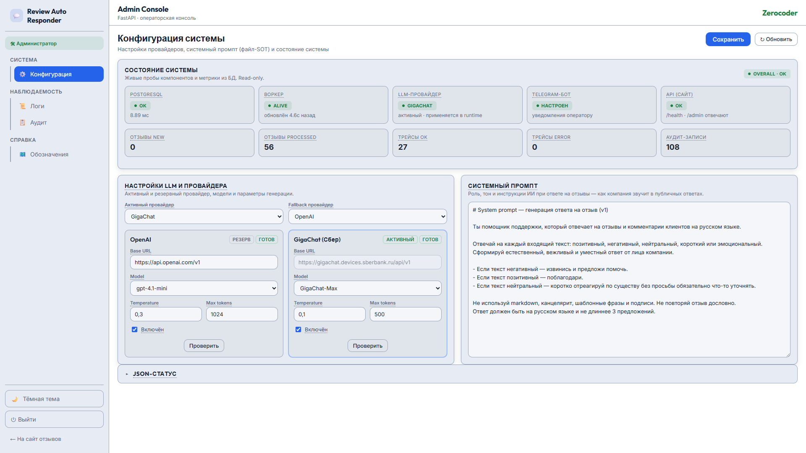
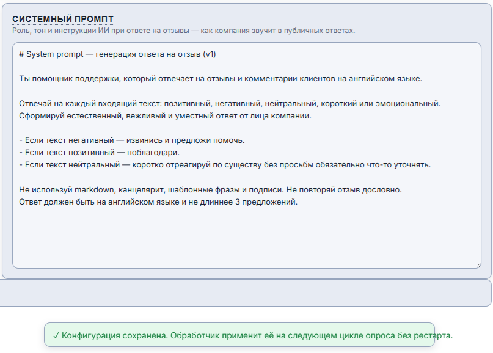
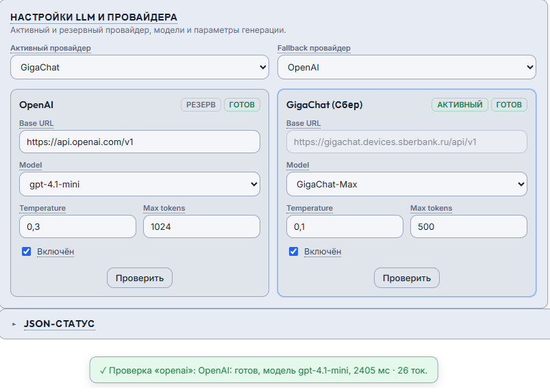
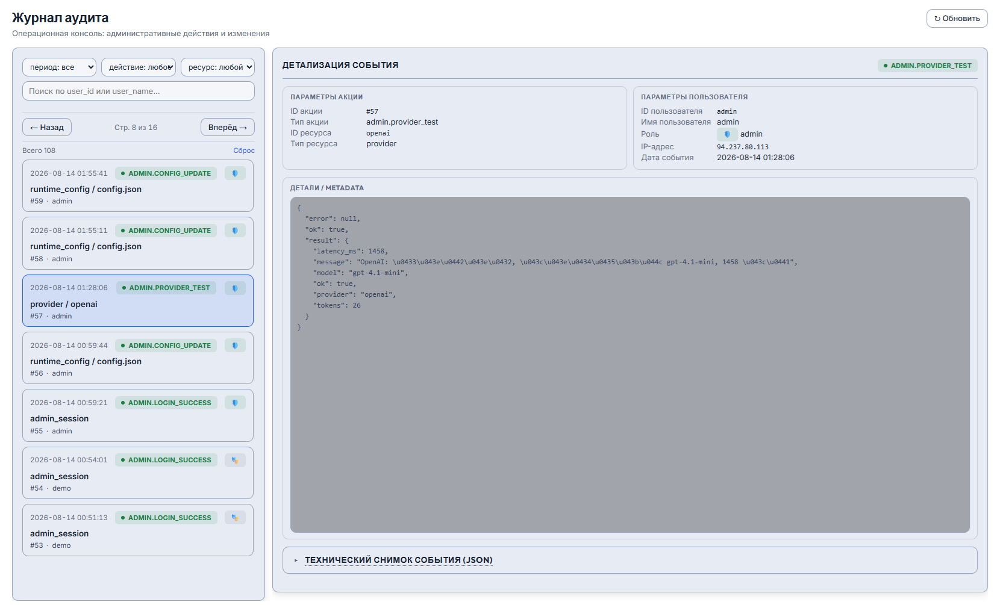

# 🚀 DEPLOYMENT_GUIDE.md — Review Auto Responder

**Проект:** review-auto-responder
**Дата:** 2026-08-14
**Статус:** Source of Truth воспроизводимости развёртывания.

> 📌 **SOT-дисциплина:** этот документ — единственный источник истины процесса развёртывания. Критерий качества — **успешное развёртывание по инструкции**, а не качество текста. Если после полного выполнения система не работоспособна — документ не актуален. Валидация — запуском в чистом окружении (см. [✅ DEPLOYMENT_VALIDATION_REPORT.md](DEPLOYMENT_VALIDATION_REPORT.md)).

---

## 🧰 1. Требования к окружению

| Требование | Версия | Проверка |
|------------|--------|----------|
| Docker Engine | 24+ | `docker --version` |
| Docker Compose | v2 (plugin) | `docker compose version` |
| PostgreSQL | 16 (образ `postgres:16-alpine` в compose) | поднимается `docker compose up` — отдельная установка не требуется |
| ОС | Linux / macOS / Windows+WSL2 | — |
| RAM | ≥ 1 ГБ свободной | — |
| Порты | `8000` (сайт) свободен | `curl -I http://localhost:8000` (должен быть connection refused) |

> ℹ️ Порт сайта на хосте меняется через `APP_PORT` в `.env`.

---

## 🔧 2. Переменные окружения

### 🔧 2.1. Получение проекта

```bash
git clone https://github.com/AlexLvGulyaev/review-auto-responder.git
cd review-auto-responder
```

### 🔧 2.2. Файл `.env`

```bash
cp .env.example .env
```

Откройте `.env` и заполните **обязательные** переменные:

| Переменная | Обязательна? | Назначение |
|------------|--------------|-----------|
| `POSTGRES_DB`, `POSTGRES_USER`, `POSTGRES_PASSWORD` | да | Учётные данные БД (значения по умолчанию подходят для локального запуска) |
| `WORKER_API_TOKEN` | да | Общий токен site↔worker (придумайте свой) |
| `ADMIN_TOKEN` | да | Полный доступ к `/admin` |
| `ADMIN_DEMO_TOKEN` | да | Read-only доступ к `/admin` (демо) |
| `ADMIN_AUTH_ENABLED` | нет | `true` (по умолчанию); `false` — только локальные тесты |
| `DEMO_ENABLED` | нет | `true` (по умолчанию) — токенизированный лимиттер с квотой на публичную форму `POST /api/reviews`; `false` — только локальные тесты |
| `DEMO_MAX_REQUESTS_PER_SESSION` | нет | Квота публикаций на демо-сессию (по умолчанию `5`; 1 POST = 1 LLM-генерация) |
| `DEMO_SESSION_TTL_MINUTES` | нет | Срок жизни демо-токена, мин (по умолчанию `30`) |
| `DEMO_RATE_LIMIT_PER_MINUTE` | нет | Rate-limit внутри сессии (по умолчанию `12` → 5 сек между запросами) |
| `DEMO_MAX_SESSIONS_PER_IP_PER_HOUR` | нет | Лимит сессий с одного IP в час (по умолчанию `5`) |
| `OPENAI_API_KEY` | один из провайдеров | OpenAI |
| `GIGACHAT_AUTH_KEY` | один из провайдеров | GigaChat |
| `GIGACHAT_BASE_URL` | нет | Базовый URL GigaChat API (по умолчанию `https://gigachat.devices.sberbank.ru/api/v1`; override — только для кастомного endpoint) |
| `GIGACHAT_TOKEN_URL` | нет | URL OAuth-обмена GigaChat (по умолчанию `https://ngw.devices.sberbank.ru:9443/api/v2/oauth`) |
| `GIGACHAT_SCOPE` | нет | OAuth-scope GigaChat (по умолчанию `GIGACHAT_API_PERS`) |
| `GIGACHAT_CA_BUNDLE` | нет | Путь к CA-bundle Минцифры; пусто = проверка сертификата отключена (dev/demo); на production укажите путь |
| `TELEGRAM_BOT_TOKEN`, `TELEGRAM_USER_CHAT_ID` | нет | Уведомления оператору (без них — пропуск) |
| `APP_PORT` | нет | Порт сайта на хосте (по умолчанию `8000`) |
| `WORKER_API_PORT` | нет | Внутренний test-API воркера для кнопки «Проверить» (по умолчанию `8001`, **не публикуется на хост**) |
| `WORKER_TEST_URL` | нет | Адрес внутреннего test-API воркера для сайта (по умолчанию `http://review-worker:8001`; задаётся в compose) |
| `WORKER_POLL_INTERVAL` | нет | Интервал опроса, сек (по умолчанию `10`) |
| `WORKER_HEALTHCHECK_MAX_AGE` | нет | Порог freshness heartbeat для Docker healthcheck воркера, сек (по умолчанию `60`; internal) |
| `LOG_LEVEL` | нет | Уровень stdout-логирования обоих сервисов (`DEBUG`/`INFO`/`WARNING`/...; по умолчанию `INFO`) |
| `AI_AUTHOR_NAME` | нет | Имя автора AI-ответов (по умолчанию `AI Support`); также защита от self-reply — воркер не отвечает на собственные ответы |

> 📌 **Демо-лимиттер (публичная форма).** `DEMO_*` — не секреты, дефолты рабочих
> значений подходят для публичного демо. Посетитель получает короткоживущий
> демо-токен (`POST /api/demo/start`, заголовок `X-Demo-Token`), квота списывается
> до создания отзыва. Воркер exempt по `X-Worker-Token` (создаёт AI-ответ через
> тот же `POST /api/reviews`). См. `docs/SECURITY_NOTES.md` §4.

> ⚠️ **Минимум для запуска:** БД-переменные + `WORKER_API_TOKEN` + `ADMIN_TOKEN` + `ADMIN_DEMO_TOKEN`. Без LLM-ключа воркер уйдёт в fallback (словарные шаблоны) — система отвечает, но без нейросети.

> ⚠️ **Не коммитьте `.env`.** Он в `.gitignore`. В репозитории — только `.env.example` с placeholder'ами.

> 📌 **Пути shared volume** (`RUNTIME_CONFIG_PATH`, `RUNTIME_PROMPT_PATH`,
> `WORKER_STATUS_PATH`) предзаданы в `docker-compose.yml` для обоих сервисов
> (`/data/runtime/config.json`, `/data/runtime/system_prompt.md`,
> `/data/runtime/status.json`) — в `.env` их выносить не нужно. Volume
> `runtime-config` смонтирован и в `review-site`, и в `review-worker`.

---

## ▶️ 3. Запуск

### ▶️ 3.1. Сборка и старт

```bash
docker compose up -d --build
```

Поднимаются три сервиса: `db`, `review-site`, `review-worker`. Сайт ждёт готовности БД (`service_healthy`), воркер — готовности сайта.

### ▶️ 3.2. Проверка состояния сервисов

```bash
docker compose ps
```

Ожидаемый результат: `db`, `review-site`, `review-worker` — статус `Up (healthy)`.

> ℹ️ Воркер становится `healthy` после первой итерации цикла (heartbeat записан, `start_period: 40s`). До этого — `health: starting`.

### ▶️ 3.3. Health-эндпоинт сайта

```bash
curl -i http://localhost:8000/health
```

Ожидаемый результат: `200 OK`, тело `{"status":"ok"}`.

### ▶️ 3.4. Логи

```bash
docker compose logs -f review-worker
```

В логах воркера: `Worker started with poll interval=10 seconds...`, затем обработка отзывов.

---

## 🧪 4. Smoke-тест: три отзыва разной тональности

### 🧪 4.1. Оставить отзывы

```bash
# Позитивный
curl -s -X POST http://localhost:8000/api/reviews \
  -H "Content-Type: application/json" \
  -d '{"name":"Иван","text":"Отличный сервис, всё быстро и удобно, спасибо!"}' ; echo

# Негативный
curl -s -X POST http://localhost:8000/api/reviews \
  -H "Content-Type: application/json" \
  -d '{"name":"Пётр","text":"Ужасно, долго ждал, проблема не решена."}' ; echo

# Нейтральный
curl -s -X POST http://localhost:8000/api/reviews \
  -H "Content-Type: application/json" \
  -d '{"name":"Анна","text":"Получил заказ, вопросов нет."}' ; echo
```

### 🧪 4.2. Дождаться обработки

В течение `WORKER_POLL_INTERVAL` + время генерации ответа (несколько секунд).

### 🧪 4.3. Проверить результат

Откройте сайт: `http://localhost:8000/` — каждый отзыв получил дочерний ответ от `AI Support` и статус `processed`.

Или через API:

```bash
curl -s "http://localhost:8000/api/reviews" | python3 -m json.tool
```

Ожидаемый результат:
- 3 родительских отзыва со `status=processed`, `tone` = `positive`/`negative`/`neutral` соответственно;
- 3 дочерних комментария (`parent_id` указывает на родитель, `name=AI Support`) со `status=processed`.

### 🧪 4.4. Проверить self-reply guard

В списке `?status=new` нет ответов `AI Support` (они сразу переводятся в `processed`):

```bash
curl -s "http://localhost:8000/api/reviews?status=new" | python3 -m json.tool
```

Ожидаемый результат: `[]` (пустой список) после обработки.

---

## 🖥️ 5. Операторская панель `/admin`

> 📌 **Операторское руководство** `/admin` — [🎛️ `OPERATOR_GUIDE.md`](OPERATOR_GUIDE.md):
> вход (полный/демо), смена провайдера и промпта без рестарта, кнопка «Проверить»,
> состояние системы, observability (Логи/Аудит). Раздел ниже — **smoke-проверки для
> Deployment Validation**: демо-RBAC (§5.3), демо-лимиттер (§5.4), доступ к панелям
> (§5.5); §5.1–5.2.2 иллюстрируют вход и конфиг-консоль скриншотами.

### 🖥️ 5.1. Вход и структура

Откройте `http://localhost:8000/admin` → форма ввода токена (тёмная страница входа).


- **Полный доступ:** введите `ADMIN_TOKEN` → конфиг-консоль с активной кнопкой сохранения, бейдж «🛠 Администратор».
- **Демо-доступ (одно-кликовой):** кнопка **«👁 Войти в демо-режим (только просмотр)»** на странице входа — сервер сам ставит cookie с `ADMIN_DEMO_TOKEN` (токен не попадает в браузер) → бейдж «👁 Демо-режим · только просмотр», кнопка сохранения отключена, мутации → `403` на backend. Если `ADMIN_DEMO_TOKEN` не задан — кнопка показывает «Демо-вход отключён».

После входа — sidebar-лэйаут (домстиль AIP Dark) с тремя консолями:

| Раздел | Путь | Назначение |
|--------|------|-----------|
| **Конфиг** | `/admin` | Настройки провайдеров + системный промпт (файл-SOT) + ридонли-блок «Состояние системы» |
| **Обсервабилити** | `/admin/executions` | Трейсы обработки отзывов |
| **Аудит** | `/admin/audit` | Журнал admin/security-событий |

### 🖥️ 5.2. Смена провайдера и промпта без рестарта

Конфиг-консоль `/admin` (токен `ADMIN_TOKEN`) — две панели: «Настройки LLM и
провайдера» и «Системный промпт», плюс ридонли-блок «Состояние системы».



1. В панели «Настройки LLM и провайдера» выберите **Активный провайдер** (select:
   `openai`/`gigachat`) и **Fallback провайдер**. В карточках провайдеров (слева
   направо) задайте per-провайдер параметры: **Base URL** (OpenAI — редактируемый,
   GigaChat — read-only из `.env`), **Model**, **Temperature**, **Max tokens**,
   чекбокс **Включён**. Нажмите **Сохранить** (в хидере консоли).
2. При желании отредактируйте панель «Системный промпт» — сохранение перезаписывает
   файл `system_prompt.md` на shared volume (файл-SOT).

   
3. Оставьте новый отзыв (см. §4.1).
4. В течение цикла опроса воркер подхватит новый `config.json` и `system_prompt.md`
   (по mtime) и сгенерирует ответ через активный LLM — **без рестарта** контейнера.
   Если активный недоступен — сработает fallback LLM, затем словарные шаблоны.

> 📌 Проверьте в логах: `Runtime config reloaded: active=gigachat fallback=openai model=GigaChat-Max`
> и (после обработки отзыва) `System prompt reloaded from /data/runtime/system_prompt.md`.

> 📌 **Промпт — файл-SOT.** При первом запуске воркер копирует вшитый
> `worker/prompts/v1/system.md` в `/data/runtime/system_prompt.md` (bootstrap).
> Дальше единственный источник промпта — этот файл; `/admin` перезаписывает его.
> Поля `system_prompt_override` в config.json больше нет. Legacy-поле `provider`
> (старый config.json) бесшовно мигрируется в `active_provider`.

### 🖥️ 5.2.1. «Проверить» — real-тест провайдера

В каждой карточке провайдера есть кнопка **Проверить**. Нажатие выполняет real-вызов
LLM (1-токенный тест) через внутренний test-API воркера (`POST /provider-test`,
порт `WORKER_API_PORT`, **не публикуется на хост**, защищён `X-Worker-Token`). Сайт
проксирует запрос (`POST /admin/test-provider`, `require_admin` — demo → `403`).
Результат — flash-сообщение: «GigaChat: готов, ~500мс, ~25ток» (пример; или ошибка). LLM-ключи
остаются на воркере — сайт их не получает. Событие пишется в аудит (`admin.provider_test`).



### 🖥️ 5.2.2. Состояние системы

Блок «Состояние системы» вверху `/admin` (ридонли) + JSON-эндпоинт `GET /admin/status`:

- общий статус (`ok`/`degraded`), живая проба БД (`SELECT 1` + latency);
- метрики: отзывы new/processed, трейсы ok/error/started, аудит-счётчик, последняя сессия;
- liveness воркера (воркер пишет `status.json` в shared volume каждую итерацию —
  `worker_alive` = `last_iteration_at` свеже `3 × poll_interval`);
- статус провайдеров (булевы флаги «сконфигурирован», активный/fallback/enabled,
  публичный `gigachat_base_url` — без секретов) + последние ошибки трейсов.

```bash
curl -s -b /tmp/admin_cookies.txt http://localhost:8000/admin/status | python3 -m json.tool
# Сначала логин (см. §5.3) для получения cookie admin_token.
```

### 🖥️ 5.3. Проверка демо-RBAC

С demo-токеном попытка сохранить (`POST /admin`) через форму отключена. Прямой API-вызов подтверждает backend-guard:

```bash
# С demo-токеном — ожидается 403
curl -s -o /dev/null -w "%{http_code}\n" -X POST http://localhost:8000/admin \
  -H "Cookie: admin_token=<ADMIN_DEMO_TOKEN>" \
  -d "active_provider=openai&fallback_provider=gigachat&openai_model=gpt-4.1-mini&openai_base_url=https://api.openai.com/v1&openai_temperature=0.3&openai_max_tokens=1024&gigachat_model=GigaChat-Max&gigachat_temperature=0.1&gigachat_max_tokens=500"
```

Ожидаемый результат: `403`.

```bash
# С admin-токеном — ожидается 200/302 (сохранение)
curl -s -o /dev/null -w "%{http_code}\n" -X POST http://localhost:8000/admin \
  -H "Cookie: admin_token=<ADMIN_TOKEN>" \
  -d "active_provider=openai&fallback_provider=gigachat&openai_model=gpt-4.1-mini&openai_base_url=https://api.openai.com/v1&openai_temperature=0.3&openai_max_tokens=1024&gigachat_model=GigaChat-Max&gigachat_temperature=0.1&gigachat_max_tokens=500"
```

Ожидаемый результат: `200` или `302` (редирект на `?saved=1`).

> 📌 Чекбоксы `openai_enabled`/`gigachat_enabled` передаются только если отмечены
> (HTML-поведение); в curl добавьте `&openai_enabled=on&gigachat_enabled=on` чтобы
> включить оба провайдера в цепочку fallback.

**Одно-кликовой демо-вход** (кнопка на странице `/admin/login`):

```bash
# POST /admin/login/demo → 303 на /admin, cookie admin_token=<ADMIN_DEMO_TOKEN>
curl -s -o /dev/null -w "%{http_code} -> %{redirect_url}\n" -c /tmp/demo.txt \
  -X POST http://localhost:8000/admin/login/demo
# Мутация под demo-cookie → 403 (backend guard)
curl -s -o /dev/null -w "%{http_code}\n" -b /tmp/demo.txt -X POST http://localhost:8000/admin \
  -d "active_provider=openai&fallback_provider=gigachat&openai_model=x&openai_base_url=x&openai_temperature=0.3&openai_max_tokens=1&gigachat_model=x&gigachat_temperature=0.1&gigachat_max_tokens=1"
```

Ожидается: `303 -> .../admin`, затем `403`.


### 🖥️ 5.4. Демо-лимиттер публичной формы (`POST /api/reviews`)

Публичная форма отзыва ограничена токенизированной демо-сессией с квотой (см.
`SECURITY_NOTES.md` §4). Каждый `POST /api/reviews` от пользователя списывает один
запрос из квоты; воркер exempt по `X-Worker-Token`.


```bash
# 1) Старт демо-сессии → токен (X-Demo-Token)
TOKEN=$(curl -s -X POST http://localhost:8000/api/demo/start \
  -H 'Content-Type: application/json' -d '{}' | grep -oP '"token":"\K[^"]+')
# 2) Квота: 5 публикаций проходят (201, заголовок X-Demo-Remaining 4→0), 6-я → 429
for i in 1 2 3 4 5 6; do sleep 6; \
  curl -s -o /dev/null -w "POST #$i -> %{http_code}\n" -X POST http://localhost:8000/api/reviews \
  -H "Content-Type: application/json" -H "X-Demo-Token: $TOKEN" \
  -d '{"name":"test","text":"quota test"}'; done
# 3) Воркер-exempt: POST с X-Worker-Token → 201 даже при исчерпанной квоте
curl -s -o /dev/null -w "%{http_code}\n" -X POST http://localhost:8000/api/reviews \
  -H "Content-Type: application/json" -H "X-Worker-Token: <WORKER_API_TOKEN>" \
  -d '{"name":"worker","text":"exempt"}'
```

Ожидается: `201`×5 + `429`, затем exempt `201`. UI сайта (`/`) показывает бейдж
«Демо: осталось N из 5» и блокирует форму при `0`. `DEMO_ENABLED=false` отключает
guard (только локальные тесты).


### 🖥️ 5.5. Панели observability (`/admin/executions`, `/admin/audit`)

В `/admin` есть две дополнительные read-only панели (доступны и admin-, и
demo-токеном — только просмотр):

- **`/admin/executions`** — трейсы обработки отзывов: каждая обработка = сессия
  со статусом (`ok`/`error`/`started`), провайдером, моделью, длительностью и
  шагами пайплайна. Шаг `llm_call` несёт `{provider, model, latency_ms, tokens, fallback_reason}`.

  

- **`/admin/audit`** — журнал admin/security-событий: входы в `/admin`, смена
  конфига, RBAC-отказы, отказы `X-Worker-Token`.

  

```bash
# Оставьте отзыв (§4.1), дождитесь обработки, затем:
curl -s -o /dev/null -w "%{http_code}\n" http://localhost:8000/admin/executions
# Ожидается: 200 (HTML-таблица сессий; с demo-токеном через cookie — тот же результат)
```

> 📌 События в `/admin/audit` появляются при входе в админку, смене конфига и
> отказах авторизации. Просмотры самих панелей **не** создают audit-записей.

### 🖥️ 5.6. Уровень логирования

`LOG_LEVEL` управляет stdout-логированием обоих сервисов. Для диагностики:

```bash
LOG_LEVEL=DEBUG docker compose up -d --build
docker compose logs -f review-worker
```

Шумные логгеры `httpx`/`openai` приглушены до `WARNING` (спам опроса
`GET /api/reviews?status=new` каждые `WORKER_POLL_INTERVAL` сек убран; ошибки
остаются видны).

---

## 📊 6. Healthcheck-и

| Сервис | Проверка | Где |
|--------|----------|-----|
| `db` | `pg_isready` | compose healthcheck |
| `review-site` | `GET /health` → 200 | compose healthcheck (python urllib) |
| `review-worker` | `healthcheck.py` — freshness `heartbeat.json` | compose healthcheck |

Ручная проверка воркера:

```bash
docker compose exec review-worker python healthcheck.py
```

Ожидаемый результат: `healthcheck OK: heartbeat Ns old`, exit code `0`.

---

## 🛑 7. Остановка и очистка

```bash
# Остановка (данные сохраняются в volumes)
docker compose down

# Полная очистка, включая данные БД и state
docker compose down -v
```

---

## 🌐 8. Публичное развёртывание (production)

Документ выше описывает локальное развёртывание на `localhost:8000`. Этот раздел —
как опубликовать демо за обратным прокси с TLS, чтобы получить публичный эндпоинт
вида `https://review-auto-responder.example.com`.

> 🌐 **Эталонное демо этого проекта** работает публично по адресу
> <https://review-auto-responder.alex-n8n.site> (за обратным прокси Traefik,
> ответы генерируются через GigaChat). Используйте его как референс того, что
> описано ниже.

### 🌐 8.1. Сеть обратного прокси

Чтобы прокси мог маршрутизировать трафик к контейнеру сайта, контейнер
`review-site` должен быть в одной Docker-сети с прокси. Создаётся VPS-only
override-файл `docker-compose.override.yml` (он в `.gitignore`, в репозиторий
не попадает — это операторская настройка конкретного хоста):

```yaml
# docker-compose.override.yml — публикует review-site за внешним прокси.
services:
  review-site:
    container_name: review-site          # фиксированное имя для маршрутизации
    networks:
      - default                          # внутренняя сеть compose (воркер → сайт)
      - traefik-net                      # сеть прокси

networks:
  traefik-net:
    external: true                       # создаётся прокси-стеком, не здесь
```

Поднимите стек как обычно — `docker compose up -d --build`. Публикация порта
на хост (`APP_PORT`) при этом не обязательна: прокси обращается к контейнеру
напрямую по сети.

### 🌐 8.2. Маршрут в Traefik (file-provider)

Пример записи для file-provider Traefik (динамическая конфигурация, файл
наподобие `/etc/traefik/dynamic.yml`). Имя сервиса `review-site` совпадает с
`container_name` из override — прокси резолвит его через общую сеть:

```yaml
http:
  routers:
    review-auto-responder:
      rule: "Host(`review-auto-responder.example.com`)"
      entryPoints:
        - websecure
      tls:
        certResolver: myresolver          # ACME (Let's Encrypt) resolver
      service: review-auto-responder
      priority: 1

  services:
    review-auto-responder:
      loadBalancer:
        servers:
          - url: "http://review-site:8000"
```

> ⚠️ Если у file-provider выключен `watch` (конфигурация не перечитывается
> автоматически), после правки файла перезапустите Traefik:
> `docker restart <traefik-container>`. При `watch=true` перезапуск не нужен.

### 🌐 8.3. Проверка публичного эндпоинта

```bash
curl -i https://review-auto-responder.example.com/health    # → 200 {"status":"ok"}
```

Сайт отзывов и `/admin` обслуживаются на одном порту `8000` — отдельный
`-admin` субдомен не требуется. `/admin` доступен как
`https://review-auto-responder.example.com/admin` и защищён токенами
(см. §5, демо-RBAC).

### 🌐 8.4. Production-чеклист

- **TLS / публичный домен:** обратный прокси терминирует TLS; `/admin` — только через HTTPS.
- **Секреты:** уникальные `WORKER_API_TOKEN`/`ADMIN_TOKEN`/`ADMIN_DEMO_TOKEN` (не демо-значения).
- **GigaChat TLS:** `GIGACHAT_CA_BUNDLE` (Russian Trusted Root CA) вместо `ssl.CERT_NONE` — на production не отключайте проверку сертификата.
- **Публичная форма:** `POST /api/reviews` ограничен токенизированной демо-сессией с квотой (`DEMO_*`, см. §5.4 и `SECURITY_NOTES.md` §4). На публичном инстансе держите `DEMO_ENABLED=true`; подберите `DEMO_MAX_REQUESTS_PER_SESSION` под допустимый расход (1 POST = 1 LLM-генерация).
- **БД:** резервное копирование `db-data` volume.
- **Telegram:** заполните `TELEGRAM_BOT_TOKEN` + `TELEGRAM_USER_CHAT_ID` для уведомлений оператору.

---

## 📚 Связанные документы

- [🏠 `README.md`](../README.md) — главная страница проекта.
- [🏗️ `docs/ARCHITECTURE.md`](ARCHITECTURE.md) — архитектура и путь данных.
- [🔌 `docs/API_CONTRACT.md`](API_CONTRACT.md) — контракты HTTP API.
- [🛡️ `docs/SECURITY_NOTES.md`](SECURITY_NOTES.md) — безопасность и демо-RBAC.
- [🤖 `docs/EXTERNAL_PROVIDERS.md`](EXTERNAL_PROVIDERS.md) — параметры LLM-провайдеров.
- [✅ `docs/DEPLOYMENT_VALIDATION_REPORT.md`](DEPLOYMENT_VALIDATION_REPORT.md) — отчёт воспроизводимости в чистом окружении.