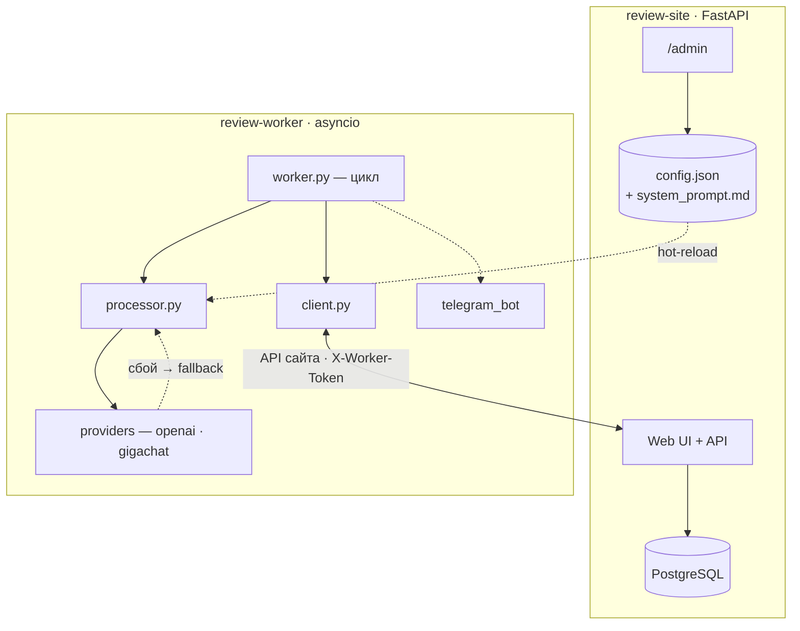

# 📋 IMPLEMENTATION_PLAN.md — Review Auto Responder

**Проект:** review-auto-responder
**Дата:** 2026-08-14
**Статус:** ✅ Реализован. Технический план доработанной версии на базе legacy-репозиториев-референсов (`github.com/MrGAN12009/worker_ai`, `app_test_2803`). Все этапы выполнены, Deployment Validation 18/18 PASS.

---

## 🎯 1. Архитектура решения

Путь данных (детально — в `docs/ARCHITECTURE.md`):

1. Клиент пишет отзыв → `POST /api/reviews` → строка `Review` `status=new` в PostgreSQL.
2. `worker.py` опрашивает `GET /api/reviews?status=new` (`client.py`) каждые `WORKER_POLL_INTERVAL` сек.
3. На каждый новый: обёртка в execution-сессию (`POST /api/executions`) → `processor.detect_tone` (словарь) → `telegram_bot` (опционально) → `processor.generate_response` (возвращает `(text, meta)`) → `providers/` (LLM) или fallback.
4. `client.create_review` постит ответ дочерним комментарием; `client.update_review` (PATCH + `X-Worker-Token`) → `status=processed` для родителя и ответа.
5. `state.py` фиксирует notified/processed; `is_ai_authored` + mark-processed защищают от self-reply.
6. `PATCH /api/executions/{id}` закрывает сессию (`ok`/`error`, провайдер/модель, шаги с LLM-метаданными).

---

## 🧩 2. Состав компонентов

### 2.1. Сайт отзывов (`site/`)

| Компонент | Файл | Назначение |
|-----------|------|------------|
| Точка входа | `app/main.py` | FastAPI app, lifespan (idempotent init схемы), router |
| Роуты | `app/api/routes.py` | `GET /`, `GET /api/reviews` (+`?status=new`), `POST /api/reviews` (guard `require_demo_or_worker`: демо-токен с квотой ИЛИ `X-Worker-Token`), `PATCH /api/reviews/{id}`, `GET /health` |
| Админка | `app/api/admin.py` | Демо-RBAC: два токена (admin/demo), role-based guard на backend (`AdminIdentity` role admin/demo, `admin_auth` чтение + `require_admin` мутация → 403 для demo), login/logout по cookie; `GET/POST /admin` пишет `config.json` |
| Execution-трейсы | `app/api/executions.py` | `POST /api/executions` (start), `PATCH /api/executions/{id}` (finish) — воркер пишет трассы под `X-Worker-Token` |
| Admin-трейсы | `app/api/admin_executions.py` | `GET /admin/executions`, `GET /admin/executions/{id}` — read-only просмотр (demo допущен) |
| Audit-API | `app/api/audit.py` | `GET /admin/audit`, `GET /admin/audit/{id}` — read-only просмотр журнала (demo допущен) |
| Демо-сессии | `app/api/demo.py` | `POST /api/demo/start` (выпуск `X-Demo-Token`, IP-лимит сессий/час), `GET /api/demo/status` (квота по токену) — v1.5 |
| Консоль состояния | `app/api/admin_status.py` | `GET /admin/status` — read-only сводка здоровья: `overall` + БД-проба (`SELECT 1`) + метрики + liveness воркера (`status.json`) + статус провайдеров; `build_system_status` переиспользуется в `/admin` |
| Демо-лимиттер | `app/services/demo_limiter.py` | `DemoLimiterService` — 3 уровня (sessions/IP/час, rate-limit-интервал, квота 5/сессию); воркер exempt по `X-Worker-Token`; backend — единственный SOT квоты — v1.5 |
| Worker-auth | `app/api/worker_auth.py` | `require_worker_token` → 401 + audit `auth.worker_denied` при плохом/отсутствующем токене |
| Audit-сервис | `app/services/audit.py` | `AuditService.log_audit` + `client_ip` (X-Forwarded-For → X-Real-IP → client.host) |
| Logging | `app/core/logging.py` | `configure_logging()` через dictConfig, уровень `LOG_LEVEL` |
| Схемы | `app/schemas.py` | `ReviewCreate`, `ReviewRead`, `ReviewUpdate`, `RuntimeConfigUpdate`, execution/audit/demo схемы (Pydantic) |
| Модели БД | `app/models/review.py`, `execution.py`, `audit.py`, `demo_session.py` | `Review` (самоссылка), `ExecutionSession`+`ExecutionStep`, `AuditLog`, `DemoSession` (v1.5) |
| Сессия БД | `app/db/session.py` | async engine, session factory, `get_db_session` |
| Базовый класс | `app/db/base.py` | `DeclarativeBase` |
| Конфиг | `app/config.py` | Pydantic-settings из `.env`, `database_url` computed, `admin_token`, `admin_demo_token`, `admin_auth_enabled`, `runtime_config_path`, `log_level` |
| Шаблон | `app/templates/index.html` | Web UI, опрос каждые 5с, дерево комментариев |
| Админ-шаблоны | `app/templates/admin.html`, `admin_login.html`, `executions.html`, `execution_detail.html`, `audit.html`, `audit_detail.html` | Форма runtime-config + панели observability (read-only) + форма входа по токену |
| Dockerfile | `site/Dockerfile` | python:3.12-slim, uvicorn |
| Требования | `site/requirements.txt` | fastapi, uvicorn, sqlalchemy, asyncpg, pydantic, jinja2, python-multipart |

### 2.2. Обработчик (`worker/`)

| Компонент | Файл | Назначение |
|-----------|------|------------|
| Точка входа | `worker.py` | Основной цикл, `wait_for_site`, `process_new_reviews` (обёртка каждого отзыва в execution-сессию), heartbeat |
| HTTP-клиент | `client.py` | `check_site`, `fetch_new_reviews` (через `?status=new`), `create_review`, `update_review`, `start_execution`, `finish_execution` |
| Классификатор | `processor.py` | `detect_tone` (словарь маркеров), `build_fallback_response`, `generate_response` → `(text, meta)` где `meta={provider, model, latency_ms, tokens, fallback_reason}` |
| Провайдеры | `providers/base.py` | `ResponseProvider` ABC: `async generate(system, user, max_tokens=None) -> str`, `async test_connection()`, `name`/`model_name`/`last_usage` для observability |
| OpenAI-совместимый | `providers/openai_provider.py` | OpenAI SDK Chat Completions; `base_url`/`temperature`/`max_tokens` из runtime-config |
| GigaChat | `providers/gigachat_provider.py` | OAuth-адаптер, async-обёртка через `asyncio.to_thread`; `temperature`/`max_tokens` из runtime |
| Фабрика | `providers/factory.py` | `build_provider_for_key`/`build_active_provider`/`build_fallback_provider` по `active_provider`/`fallback_provider` + `*_enabled` (openai/gigachat, не env) |
| Test-API воркера | `worker/api.py` | stdlib `asyncio.start_server` (порт `WORKER_API_PORT`, внутр.); `POST /provider-test` (X-Worker-Token) → `test_connection` |
| Runtime-config | `runtime_config.py` | mtime-кеш `config.json` из shared volume + `threading.Lock`; `get(key)`; миграция legacy `provider`→`active_provider` |
| Промпт | `prompt_loader.py` | Чтение `system_prompt.md` из shared volume (файл-SOT, mtime-кеш); fallback на вшитый `prompts/v1/system.md` |
| Промпт-файл | `prompts/v1/system.md` | Начальный default для bootstrap (копируется в shared volume при первом запуске) |
| Состояние | `state.py` | `state.json`: `notified_review_ids`, `processed_review_ids` |
| Telegram | `telegram_bot.py` | `send_new_review_notification` (опционально) |
| Модели | `models.py` | `RemoteReview`, `ReviewCreatePayload`, `ReviewUpdatePayload`, `ReviewStatus`, `ReviewTone` |
| Конфиг | `config.py` | Pydantic-settings из `.env` (секреты + пути); `runtime_config_path`, `log_level` |
| Logging | `logging_config.py` | `configure_logging()` через dictConfig + приглушённые `httpx`/`openai` |
| Dockerfile | `worker/Dockerfile` | python:3.12-slim, `python worker.py`, healthcheck по heartbeat |
| Требования | `worker/requirements.txt` | httpx, openai, pydantic, pydantic-settings |

### 2.3. Оркестрация

| Компонент | Файл | Назначение |
|-----------|------|------------|
| Единый compose | `docker-compose.yml` | `db` + `review-site` + `review-worker`, healthcheck'и, общий `WORKER_API_TOKEN`, shared volume `runtime-config`, `LOG_LEVEL` |
| Переменные | `.env.example` | Все переменные обоих сервисов с placeholder'ами (`ADMIN_TOKEN`, `ADMIN_DEMO_TOKEN`, `WORKER_API_TOKEN`, `LOG_LEVEL`, ключи провайдеров) |

---

## 📐 3. Модель данных

### 3.1. БД-таблицы (сайт, PostgreSQL)

Создаются `Base.metadata.create_all` в lifespan сайта (без Alembic — idempotent
для существующей БД демо). Подробная схема полей — в
[🏗️ `docs/ARCHITECTURE.md`](ARCHITECTURE.md) §3:

- `reviews` — отзыв/комментарий (самоссылка `parent_id`, `status` new/processed,
  `tone`; `response` — legacy-зарезервировано, ответ публикуется дочерним комментарием).
- `execution_sessions` + `execution_steps` — execution-tracing, контур 2
  (статус/провайдер/модель/длительность + стадии пайплайна с LLM-метаданными).
- `audit_logs` — журнал admin/security-событий, контур 3.
- `demo_sessions` (v1.5) — токенизированная демо-квота на `POST /api/reviews`:
  `token` (`X-Demo-Token`), `session_id`, `client_ip`, `requests_used`/`requests_limit`
  (default `DEMO_MAX_REQUESTS_PER_SESSION`=5), `is_active`, `created_at`, `expires_at`
  (`DEMO_SESSION_TTL_MINUTES`=30), `last_request_at`. Воркер exempt по `X-Worker-Token`.

> 📌 Дублирование схемы БД между планом и архитектурой устранено: ARCHITECTURE §3 —
> единственный SOT описания полей; IMPLEMENTATION_PLAN §3 — только перечень и
> назначение (ссылка).

### 3.2. `state.json` — локальное состояние обработчика

| Поле | Тип | Описание |
|------|-----|----------|
| `notified_review_ids` | `list[int]` | Отзывы, по которым уже отправлено Telegram-уведомление |
| `processed_review_ids` | `list[int]` | Отзывы, по которым уже сгенерирован ответ (defensive guard) |

### 3.3. `heartbeat.json` — healthcheck обработчика

| Поле | Тип | Описание |
|------|-----|----------|
| `last_iteration_at` | `str` (ISO) | Метка времени последней итерации цикла |
| `target_site_url` | `str` | Целевой сайт (для диагностики) |

### 3.4. `config.json` — runtime-config (shared volume, пишется `/admin`)

| Поле | Тип | Описание |
|------|-----|----------|
| `active_provider` | `str` | Активный LLM-провайдер: `openai`/`gigachat` (legacy `provider` мигрируется) |
| `fallback_provider` | `str` | Fallback LLM-провайдер (если ≠ активного) |
| `openai_enabled` | `bool` | Включён ли OpenAI в цепочке fallback |
| `gigachat_enabled` | `bool` | Включён ли GigaChat в цепочке fallback |
| `openai_model` | `str` | Модель OpenAI |
| `openai_base_url` | `str` | base_url OpenAI / OpenAI-compatible endpoint |
| `openai_temperature` | `float` | Temperature OpenAI (по умолч. 0.3) |
| `openai_max_tokens` | `int` | Max tokens OpenAI (по умолч. 1024) |
| `gigachat_model` | `str` | Модель GigaChat |
| `gigachat_temperature` | `float` | Temperature GigaChat (по умолч. 0.1) |
| `gigachat_max_tokens` | `int` | Max tokens GigaChat (по умолч. 500) |

Промпт хранится отдельно — файл `system_prompt.md` на том же shared volume (файл-SOT), не поле `config.json`. `gigachat_base_url` — в `.env` (read-only в карточке).

**Секреты (`OPENAI_API_KEY`, `GIGACHAT_AUTH_KEY`) в `config.json` НЕ хранятся** — только в `.env` обработчика. `/admin` редактирует runtime-параметры, не ключи.

> 📌 Таблицы observability создаются `Base.metadata.create_all` в lifespan сайта (без Alembic) — idempotent для существующей БД.

---

## 🔌 4. Интеграции

| Интеграция | Контракт | SOT |
|------------|----------|-----|
| Сайт ↔ обработчик | `GET /api/reviews?status=new`, `POST /api/reviews`, `PATCH /api/reviews/{id}` + `X-Worker-Token` | `docs/API_CONTRACT.md` + код сайта |
| Воркер → execution-tracing | `POST /api/executions` (start), `PATCH /api/executions/{id}` (finish) + `X-Worker-Token` | `docs/API_CONTRACT.md` + код `executions.py` |
| Публичное демо (v1.5) | `POST /api/demo/start`, `GET /api/demo/status` + `X-Demo-Token`; воркер exempt по `X-Worker-Token` | `docs/API_CONTRACT.md` §1.6 + код `demo.py` |
| `/admin` → обработчик | Сайт пишет `config.json` в shared volume; обработчик читает по mtime (hot-reload, без рестарта) | `docs/ARCHITECTURE.md` + код `runtime_config.py` |
| OpenAI | Chat Completions (`/v1/chat/completions`), `Authorization: Bearer` | `docs/EXTERNAL_PROVIDERS.md` |
| GigaChat | OAuth-обмен auth_key→access_token (`/oauth`), `/chat/completions`, сертификат Минцифры | адаптер `gigachat_provider.py` (SOT — код + доки GigaChat) |
| Telegram Bot API | `POST /bot<token>/sendMessage` | код `telegram_bot.py` + доки Telegram |

**Унификация вызова:** legacy использовал OpenAI `responses.create`. Доработка переводит все провайдеры на Chat Completions — общий знаменатель (GigaChat — OpenAI-compatible Chat Completions; OpenAI поддерживает оба). Это сознательная, документированная дивергенция от legacy ради единой абстракции.

---

## 📅 5. План реализации

| # | Задача | Артефакты |
|---|--------|-----------|
| 1 | Каркас `site/` на базе `app_test_2803` + `?status=new` + `/health` | `site/app/**`, `site/Dockerfile`, `site/requirements.txt` |
| 2 | Web-`/admin` на сайте: демо-RBAC (`AdminIdentity`, два токена, `admin_auth`/`require_admin`, login/logout cookie), `templates/admin.html` + `admin_login.html`, writer `config.json` в shared volume | `site/app/api/admin.py`, `site/app/templates/admin*.html` |
| 3 | Каркас `worker/` на базе `worker_ai`: `worker.py`, `client.py` (через `?status=new`), `state.py`, `telegram_bot.py`, `models.py`, `config.py` | `worker/**` (без провайдеров пока) |
| 4 | `runtime_config.py` — mtime-кеш `config.json` из shared volume | `worker/runtime_config.py` |
| 5 | Мультипровайдерность: `providers/base.py`, `openai_provider.py`, `gigachat_provider.py` (OAuth-адаптер), `factory.py` (по `runtime.get("provider")`) | `worker/providers/**` |
| 6 | Промпт в файле: `prompt_loader.py` (override из runtime), `prompts/v1/system.md`; `processor.generate_response` делегирует провайдеру + fallback | `worker/prompts/**`, `worker/processor.py`, `worker/prompt_loader.py` |
| 7 | Heartbeat для healthcheck | `worker/worker.py`, `worker/Dockerfile` healthcheck |
| 8 | Единый `docker-compose.yml` + `.env.example` (shared volume `runtime-config`) | `docker-compose.yml`, `.env.example` |
| 9 | Документация: `ARCHITECTURE.md` (путь данных), `API_CONTRACT.md`, `SECURITY_NOTES.md`, `DEPLOYMENT_GUIDE.md`, `EXTERNAL_PROVIDERS.md` | `docs/**` |
| 10 | Локальная сборка + верификация (3 отзыва разной тональности; смена провайдера через `/admin` без рестарта) | `docs/TESTING.md` |
| 11 | Deployment Validation в чистом окружении | `docs/DEPLOYMENT_VALIDATION_REPORT.md` |
| 12 | Публичный репозиторий + README + живое демо | `README.md` |
| 13 | Observability: три контура (stdout-логирование, execution-tracing, аудит) + панели `/admin/executions`, `/admin/audit` | `site/app/core/`, `site/app/models/execution.py`, `audit.py`, `site/app/services/audit.py`, `site/app/api/executions.py`, `audit.py`, `admin_executions.py`, `worker/logging_config.py`, шаблоны |

---

## ✅ 6. Критерии готовности

- [x] Единый `docker compose up --build -d` поднимает `db` + `review-site` + `review-worker`; сайт отвечает, обработчик опрашивает.
- [x] `GET /health` сайта → 200; healthcheck обработчика (heartbeat) → healthy.
- [x] `GET /api/reviews?status=new` отдаёт только новые отзывы.
- [x] Три отзыва (позитивный/негативный/нейтральный): тон определён, ответ сгенерирован, статус `processed`.
- [x] `active_provider`/`fallback_provider` (через `/admin`) = openai/gigachat — ответ генерируется через активный LLM; при сбое/нет ключа — fallback LLM, затем словарные шаблоны. Per-провайдер `temperature`/`max_tokens`/`enabled` применяются в runtime.
- [x] `/admin` меняет провайдер/модель/temperature/max_tokens/промпт в runtime — применяется на следующем цикле опроса без рестарта обработчика.
- [x] «Проверить» — real-тест провайдера через внутренний test-API воркера (порт `WORKER_API_PORT`, не публикуется); сайт проксирует, LLM-ключи остаются на воркере; demo → 403; аудит `admin.provider_test`.
- [x] Демо-RBAC: `ADMIN_DEMO_TOKEN` → чтение `/admin` разрешено, POST `/admin`/`/admin/test-provider` → 403 (backend guard); `ADMIN_TOKEN` → мутации разрешены.
- [x] Демо-стандарт входа в `/admin` (v1.5): одно-кликовой demo-login `POST /admin/login/demo` — сервер ставит cookie с `ADMIN_DEMO_TOKEN`, токен не попадает в браузер; demo-RBAC — чтение разрешено, мутации → 403.
- [x] Сессионные ограничения сайта отзывов (v1.5): токенизированный демо-лимиттер (`DemoSession` + `DemoLimiterService`, 3 уровня) на `POST /api/reviews`; `POST /api/demo/start` + `GET /api/demo/status`, header `X-Demo-Token`; воркер exempt по `X-Worker-Token`.
- [x] Промпт — файл-SOT на shared volume (`system_prompt.md`, bootstrap из вшитого `prompts/v1/system.md`); правка через `/admin` перезаписывает файл и влияет на ответ без правки кода.
- [x] Секреты (ключи API) только в `.env`; `config.json` содержит только runtime-параметры.
- [x] Self-reply предотвращён (обработчик не отвечает на собственные ответы).
- [x] Telegram-уведомление при настроенном токене; пропуск без него.
- [x] Секреты в `.env` (не в репозитории); `.env.example` с placeholder'ами.
- [x] Deployment Validation пройдена в чистом окружении (отчёт 18/18 PASS).
- [x] Observability: stdout-логирование (`LOG_LEVEL`), execution-tracing (`/admin/executions` с LLM-метриками), аудит (`/admin/audit`).
- [x] Публичная документация самодостаточна (нет ссылок на документы, отсутствующие в репозитории).

---

## 📚 Связанные документы

- [🏠 `README.md`](../README.md) — главная страница проекта.
- [📊 `docs/PROJECT_STATE.md`](PROJECT_STATE.md) — паспорт состояния.
- [🏗️ `docs/ARCHITECTURE.md`](ARCHITECTURE.md) — архитектура и путь данных.
- [🔌 `docs/API_CONTRACT.md`](API_CONTRACT.md) — контракты интеграций.
- [🚀 `docs/DEPLOYMENT_GUIDE.md`](DEPLOYMENT_GUIDE.md) — развёртывание с нуля.
- [🔐 `docs/SECURITY_NOTES.md`](SECURITY_NOTES.md) — безопасность и демо-RBAC.
- [🤖 `docs/EXTERNAL_PROVIDERS.md`](EXTERNAL_PROVIDERS.md) — LLM-провайдеры.
- [✅ `docs/DEPLOYMENT_VALIDATION_REPORT.md`](DEPLOYMENT_VALIDATION_REPORT.md) — отчёт воспроизводимости.