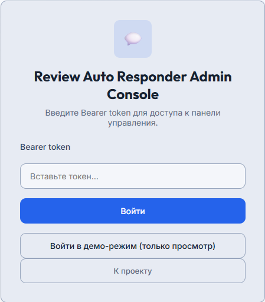
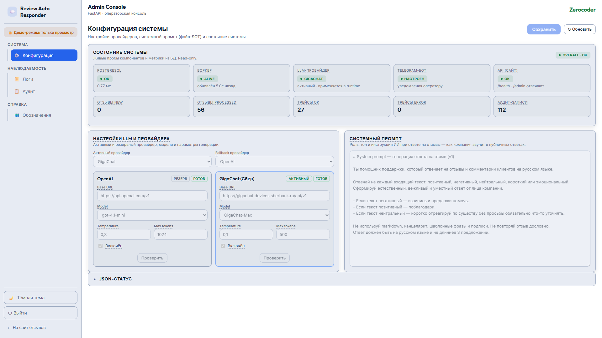

# 🛡️ SECURITY_NOTES.md — Review Auto Responder

**Проект:** review-auto-responder
**Дата:** 2026-08-14
**Статус:** Engineering Layer — безопасность, доступ, демо-RBAC.

---

## 🔐 1. Секреты

| Секрет | Где | Назначение |
|--------|-----|-----------|
| `WORKER_API_TOKEN` | `.env` (общий для site + worker) | Авторизация `PATCH` воркера |
| `ADMIN_TOKEN` | `.env` | Полный доступ к `/admin` (мутации) |
| `ADMIN_DEMO_TOKEN` | `.env` | Read-only доступ к `/admin` (демо) |
| `OPENAI_API_KEY` | `.env` | Провайдер OpenAI |
| `GIGACHAT_AUTH_KEY` | `.env` | Провайдер GigaChat (OAuth-обмен) |
| `TELEGRAM_BOT_TOKEN` | `.env` | Уведомления оператору |

> ⚠️ **Все секреты — только в `.env`.** `.env` в `.gitignore`; в репозитории — `.env.example` с placeholder'ами `YOUR_*`. Ключи API **никогда** не попадают в файлы shared volume (`config.json`, `system_prompt.md`, `status.json`) и не передаются через `/admin`. Воркер пишет в `status.json` только булевы флаги «провайдер сконфигурирован» и публичный несекретный `gigachat_base_url` — не значения ключей.

> 🔒 **«Проверить» (test-API воркера).** Кнопка «Проверить» в `/admin` выполняет real-вызов LLM, но LLM-ключи остаются **только на воркере**: сайт проксирует запрос (`POST /admin/test-provider`) во внутренний test-API воркера (`POST /provider-test`, порт `WORKER_API_PORT`, **не публикуется на хост**), защищённый `X-Worker-Token` (= `WORKER_API_TOKEN`). Публичный сайт ключей не получает. Эндпоинт — `require_admin` (demo → `403` + audit).

---

## 🛡️ 2. Демо-RBAC для `/admin`

Реализован как демо-RBAC на два токена (admin/demo), role-based guard на backend.

### 🛡️ 2.1. Два токена, две роли

| Токен | `user_role` | `is_demo` | Возможности |
|-------|-------------|-----------|-------------|
| `ADMIN_TOKEN` | `admin` | `false` | Чтение + мутация runtime-config |
| `ADMIN_DEMO_TOKEN` | `demo` | `true` | Только чтение; мутация → `403` |

Токен передаётся через cookie `admin_token` (сессия 8 часов после `/admin/login`). Идентичность — `AdminIdentity(user_id, user_name, user_role)`; `is_demo` — производное свойство.

### 🛡️ 2.2. Две зависимости-гарда

| Зависимость | Допуск | Применение |
|-------------|--------|-----------|
| `admin_auth` | любой валидный токен (admin **и** demo) | `GET /admin` — чтение |
| `require_admin` | только `admin` (demo → `403`) | `POST /admin` — мутация |

> 📌 **Backend — единственный реальный guard.** В demo-режиме UI дополнительно отключает кнопку сохранения и показывает бейдж «👁 Демо-режим: только просмотр» — это удобство оператора, а не защита. Прямой `POST /admin` с demo-токеном (curl/инструмент) отклоняется на backend.

### 🛡️ 2.3. Почему не HTTP Basic

> ❌ **Failed Approach:** HTTP Basic с двумя пользователями. Минусы: браузер кеширует Basic-credentials и не позволяет «выйти» без закрытия вкладок; нет отдельного lifecycle у demo-доступа; сложнее отличить роли в логах. Токен-cookie + `AdminIdentity` решает это: явный login/logout, отдельный demo-токен со своим lifecycle, роль в audit-логах.

### 🛡️ 2.4. Отключение auth (только локальные тесты)

`ADMIN_AUTH_ENABLED=false` в `.env` переводит `_identity_from_request` в режим «все запросы — admin». **Только для локальной разработки/тестов**, не для публичного демо.

---

## 🔓 3. Доступ к публичному API отзывов

| Эндпоинт | Авторизация | Обоснование |
|----------|-------------|-------------|
| `GET /`, `GET /api/reviews`, `GET /health` | открыт | Публичный сайт + health |
| `POST /api/reviews` | `X-Demo-Token` (демо-квота) **или** `X-Worker-Token` (воркер-exempt) | Публичная форма ограничена токенизированной демо-сессией с квотой; воркер создаёт AI-ответ через тот же эндпоинт и exempt по сервисному токену (см. §4) |
| `PATCH /api/reviews/{id}` | `X-Worker-Token` | Мутация статуса — только воркер |

> 📌 **Реализовано (v1.5):** токенизация с квотой на публичную форму `POST /api/reviews`
> (ранее отложено за границу v1.0). Публичный посетитель получает короткоживущий
> демо-токен (`POST /api/demo/start`), передаёт его заголовком `X-Demo-Token`;
> backend валидирует токен и списывает один запрос из квоты до создания отзыва.
> Воркер — доверенный внутренний вызов, exempt по `X-Worker-Token` (см. §4).

---

## 📊 4. Токенизация публичной формы (демо-лимиттер)

Публичная форма отзыва запускает воркер → вызов LLM → стоимость. Для публичного
демо реализован лимиттер по короткоживущим токенам с квотой на отзывы —
ограничивает число LLM-генераций на одного анонимного клиента.

**Четыре уровня ограничения:**

| Уровень | Параметр | Защита от |
|---------|----------|-----------|
| Max сессий с IP в час | `DEMO_MAX_SESSIONS_PER_IP_PER_HOUR=5` | массовой генерации сессий |
| Min интервал между запросами | `DEMO_RATE_LIMIT_PER_MINUTE=12` (→ 5 сек) | спама внутри сессии |
| Max запросов на сессию | `DEMO_MAX_REQUESTS_PER_SESSION=5` | длительного абуза (1 POST = 1 LLM-генерация) |
| TTL сессии (самоочистка) | `DEMO_SESSION_TTL_MINUTES=30` | «вечных» сессий с накопленной квотой; истёкшая сессия → `is_active=false` / `401` |

**Транспорт:** токен живёт в `localStorage` браузера, передаётся заголовком
`X-Demo-Token` на `POST /api/reviews` и `GET /api/demo/status`. Смена IP не
сбрасывает квоту (стабильная единица учёта — токен, а не IP); очистка
`localStorage` = новая сессия = новая квота (допустимо для демо). Backend —
единственный SOT квоты: UI лишь отображает.

**Exempt воркера:** воркер создаёт AI-ответ через тот же `POST /api/reviews`.
Валидный `X-Worker-Token` → обход квоты (воркер — доверенный внутренний вызов,
не демо-пользователь). Без exempt воркер упёрся бы в квоту и положил pipeline.

**Поведение при исчерпании:** `403` (нет/невалидный токен), `401` (сессия истекла),
`429` (квота исчерпана / rate-limit / слишком много сессий с IP). UI показывает
бейдж «Демо: осталось N из 5», при `0` — блокирует форму и предлагает обновить
страницу для новой сессии.

> 📌 **Статус:** реализовано (v1.5). `DEMO_ENABLED=false` отключает guard (только
> для локальных тестов). Параметры — env-tunable (см. `.env.example`).

---

## 🔧 5. Токены по умолчанию

> ⚠️ Значения `change-me` в коде — заглушки. **Перед любым запуском кроме локального** задать реальные значения в `.env`: `WORKER_API_TOKEN`, `ADMIN_TOKEN`, `ADMIN_DEMO_TOKEN`. Развёртывание со значениями по умолчанию в публично доступном окружении — уязвимость.

---

## 📜 6. Audit trail (контур аудита)

Все admin/security-события пишутся в таблицу `audit_logs` (контур 3 observability):
кто (`user_id`/`user_name`/`user_role`), что (`action`), над чем
(`resource_type`/`resource_id`), откуда (`ip_address`), контекст (`details` JSON).

| Action | Триггер | Записывается |
|--------|---------|--------------|
| `admin.login_success` / `admin.login_failed` | `POST /admin/login` | user, ip, path |
| `admin.login_success` (demo) | `POST /admin/login/demo` (одно-кликовой демо-вход) | user=demo, role=demo, ip, `details.entry=demo_button` |
| `admin.config_update` | `POST /admin` (сохранение) | active/fallback/enabled, per-провайдер model/base_url/temperature/max_tokens, prompt_len, prompt_changed, changed_keys |
| `admin.provider_test` | `POST /admin/test-provider` («Проверить») | provider, ok, результат (latency/tokens/message), error |
| `admin.rbac_denied` | demo-попытка мутации → `403` | user, ip, path |
| `auth.worker_denied` | плохой `X-Worker-Token` → `401` | ip, path |

> 🛡️ **Что НЕ попадает в аудит:**
> - **Секреты** — ключи API, токены никогда не пишутся в `details`.
> - **Полный текст промпта** — только его длина (`prompt_len`) и факт изменения (`prompt_changed`), список изменённых ключей (`changed_keys`).
> - **Read-only-просмотры** (`/admin`, `/admin/audit`, `/admin/executions`, `/admin/status`) — не аудируются, чтобы журнал не засорялся self-noise.

Просмотр журнала: `GET /admin/audit` (read-only, demo-токен допущен). Деталь
записи: `GET /admin/audit/{id}`. См. [🔌 API_CONTRACT.md §4](API_CONTRACT.md).

IP-адрес извлекается по цепочке `X-Forwarded-For` → `X-Real-IP` → `client.host`
(корректно за обратным прокси с TLS-терминацией).

---

## 🔁 7. Execution tracing (контур observability обработки)

Трассы обработки каждого отзыва пишутся в `execution_sessions` + `execution_steps`
(контур 2 observability). Это **не безопасность**, а observability: статус
обработки, провайдер/модель, длительность, шаги пайплайна и LLM-метрики
(latency/tokens/fallback_reason). Сессия создаётся воркером через
`POST /api/executions` (start) и закрывается `PATCH /api/executions/{id}` (finish).

> 🛡️ **С точки зрения безопасности:** эндпоинты `/api/executions` защищены тем же
> `X-Worker-Token`, что и `PATCH /api/reviews` — внешняя запись трасс
> невозможна. При падении воркера между start и finish остаётся `started`-сессия
> (диагностический признак, не уязвимость). Просмотр `/admin/executions` —
> read-only за `admin_auth` (demo допущен).

См. [🏗️ ARCHITECTURE.md §7](ARCHITECTURE.md) и [🔌 API_CONTRACT.md §3](API_CONTRACT.md).

---

## 📚 Связанные документы

- [🔌 `docs/API_CONTRACT.md`](API_CONTRACT.md) — контракты HTTP API.
- [🤖 `docs/EXTERNAL_PROVIDERS.md`](EXTERNAL_PROVIDERS.md) — параметры провайдеров.
- [🚀 `docs/DEPLOYMENT_GUIDE.md`](DEPLOYMENT_GUIDE.md) — развёртывание и env.