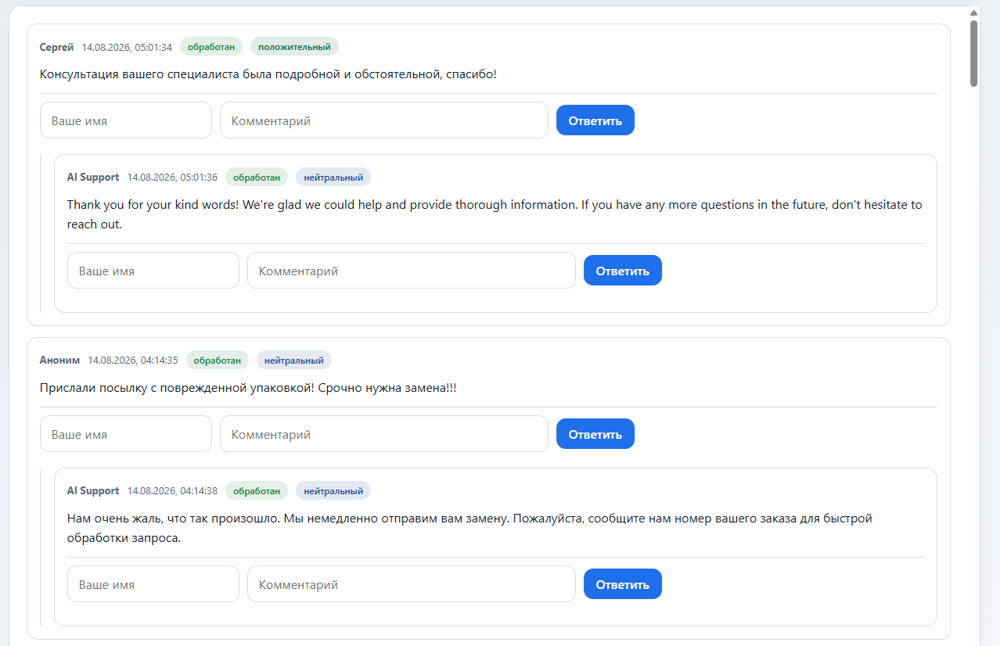
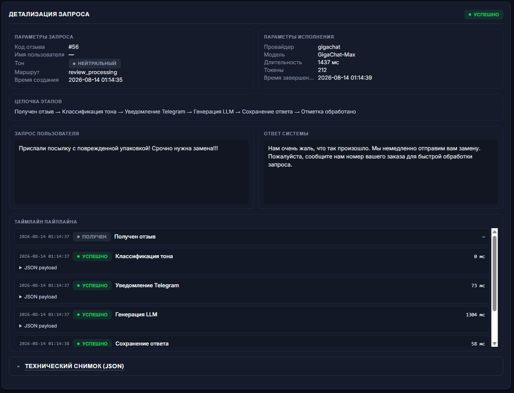
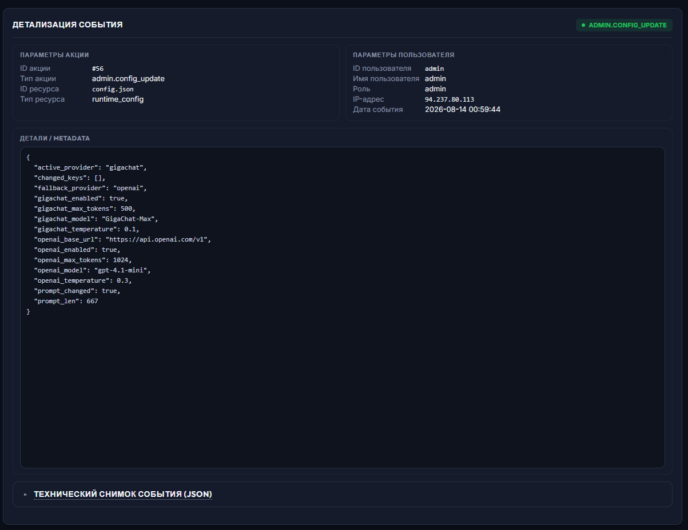

# 🎬 Review Auto Responder — демонстрация системы

**Проект:** review-auto-responder
**Дата:** 2026-08-14

🌐 **Live Demo:**
- [▶️ Открыть сайт отзывов](https://review-auto-responder.alex-n8n.site)
- [▶️ Открыть операторскую панель](https://review-auto-responder.alex-n8n.site/admin)

Полный скриншот-тур по системе: публичный сайт отзывов, операторская панель
`/admin`, контуры observability и внешний канал доставки в Telegram. Ответы на
демо генерируются нейросетью (GigaChat).

---

## 🚀 1. Как открыть live demo

1. Откройте [сайт отзывов](https://review-auto-responder.alex-n8n.site) — публичная
   форма без регистрации.
2. Оставьте отзыв — через несколько секунд под ним появится ответ `AI Support`.
3. Операторская панель: [▶️ `/admin`](https://review-auto-responder.alex-n8n.site/admin) —
   два пути входа: полный токен или одно-кликовой демо-вход (только просмотр).

Публичное демо защищено токенизированной квотой (5 публикаций на сессию) —
см. [§2.3](#🏷️-23-исчерпание-квоты).

---

## 🌐 2. Публичный сайт отзывов

### 🏷️ 2.1. Форма отзыва и демо-бейдж квоты

Посетитель получает короткоживущий демо-токен (в `localStorage`); бейдж над
формой показывает остаток квоты сессии. Каждый отправленный отзыв запускает
генерацию ответа нейросетью, поэтому число публикаций ограничено.

### 🤖 2.2. Ответ ИИ в треде

После отправки воркер автономно определяет тональность, генерирует ответ через
LLM и публикует его как дочерний комментарий в той же ветке. Бейдж квоты
уменьшается на единицу. Структура обсуждения сохраняется.

Воркер создаёт ответ тем же эндпоинтом `POST /api/reviews`, но exempt от квоты
по сервисному токену — поэтому ответы ИИ не расходуют квоту посетителя.

### 🚫 2.3. Исчерпание квоты

Когда квота сессии закончилась, форма блокируется и предлагается обновить
страницу для новой сессии. Backend — единственный источник истины квоты; UI
лишь отображает состояние.

---

## 🖥️ 3. Операторская панель `/admin`

### 🔐 3.1. Вход — два пути

Страница входа в стиле AIP Dark предлагает два пути: полный доступ по токену
(смена провайдера/модели/промпта) и одно-кликовой демо-вход. При демо-входе
сервер сам ставит cookie с демо-токеном — токен не попадает в браузер.

### 👁️ 3.2. Демо-режим (только просмотр)

В демо-режиме в сайдбаре горит бейдж «🔒 Демо-режим: только просмотр», кнопка
сохранения отключена. Мутации блокируются на backend — прямой `POST /admin` с
демо-токеном отклоняется (`403`). Чтение конфигурации, состояния, логов и аудита
доступно.

### 🎛️ 3.3. Конфиг-консоль — runtime-переключение провайдера

Под полным доступом: карточки провайдеров (OpenAI/GigaChat) со всеми
параметрами (Base URL/Model/Temperature/Max tokens/Включён/Проверить),
active/fallback LLM-цепочка, правка системного промпта. Ряд «Состояние системы» —
живые пробы БД, воркера, LLM, Telegram и API. Изменения применяются на
следующем цикле опроса без рестарта.

### ✅ 3.4. «Проверить» — real-тест провайдера

Кнопка «Проверить» выполняет 1-токенный вызов через внутренний test-API воркера.
LLM-ключи остаются на воркере — сайт лишь проксирует запрос и показывает
latency/токены. Demo → `403`.

### 📝 3.5. Смена системного промпта в runtime

Оператор правит текст промпта и сохраняет — файл `system_prompt.md` на shared
volume перезаписывается (файл-SOT) и применяется на следующем цикле опроса без
рестарта. Мутация доступна только полному токену.

### 🪄 3.6. Эффект смены промпта

После сохранения нового `system_prompt.md` воркер применяет его на следующем
цикле — новый отзыв получает ответ уже в изменённом стиле (видна разница рядом со
старым ответом). Рестарт не требуется.

---

## 📊 4. Observability — три контура

### 📈 4.1. Консоль «Логи» — трассы обработок

Master-detail «Запрос → Ответ»: левый список обработок с фильтрами
(период/статус/тон) и поиском по `review_id`; правая панель — цепочка этапов
пайплайна (получение → классификация тона → генерация LLM → сохранение → отметка
обработано) с per-step-метриками latency/токенов и таймлайном.

### 🔍 4.2. Детализация одной обработки

Deep-link даёт прямую ссылку на конкретный отзыв для разбора инцидента: полная
трасса — параметры запроса/исполнения, цепочка этапов с per-step-метаданными
(провайдер/модель, latency, токены, fallback-причина) и таймлайн.

### 📜 4.3. Консоль «Аудит» — журнал событий

Master-detail журнала: левый список с фильтрами (период/тип действия/тип ресурса)
и поиском по пользователю; правая панель — параметры действия, исполнитель и
JSON-снимок изменённого состояния. Фиксирует входы в `/admin`, смену конфигурации,
RBAC-отказы и отказы сервисного токена.

### 🧾 4.4. Детализация одной записи аудита

Deep-link для прямой ссылки на конкретное событие: тип действия, исполнитель,
metadata и JSON-снимок состояния до/после. Секреты и полный текст промпта в
`details` не пишутся.

---

## 📣 5. Telegram — внешний канал доставки

Параллельно с ответом на сайте ассистент отправляет оператору в Telegram
короткое сообщение: текст отзыва и определённая тональность. Оператор мгновенно
видит негатив и может подключиться лично там, где автономный AI-ответ вопрос не
решает. Этап `telegram` в execution-трейсе фиксирует отправку.

---

## 📚 Связанные документы

- [🏠 `README.md`](../README.md) — главная страница проекта.
- [📖 `docs/USER_GUIDE.md`](USER_GUIDE.md) — как пользоваться сайтом отзывов.
- [🏗️ `docs/ARCHITECTURE.md`](ARCHITECTURE.md) — архитектура и путь данных.
- [🛡️ `docs/SECURITY_NOTES.md`](SECURITY_NOTES.md) — безопасность, демо-RBAC и квота.
- [🚀 `docs/DEPLOYMENT_GUIDE.md`](DEPLOYMENT_GUIDE.md) — развёртывание и operator-guide.