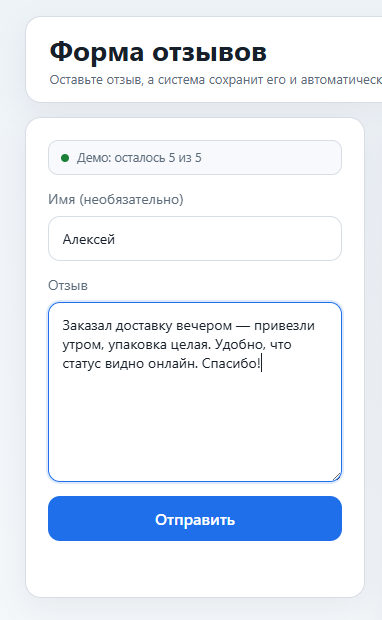
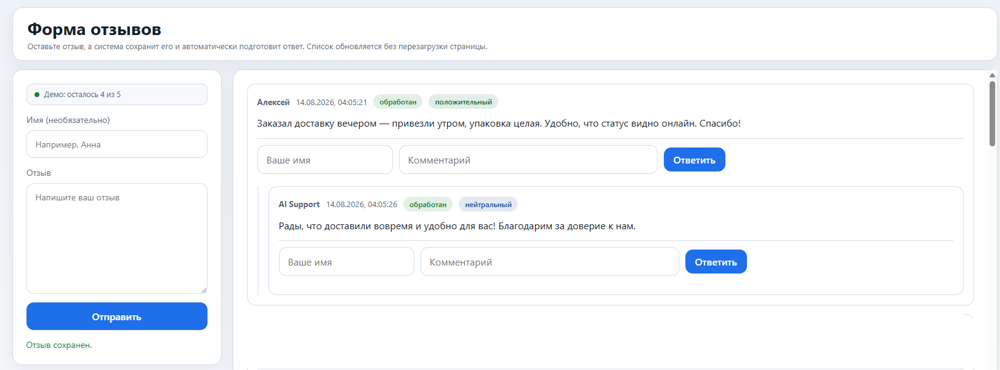
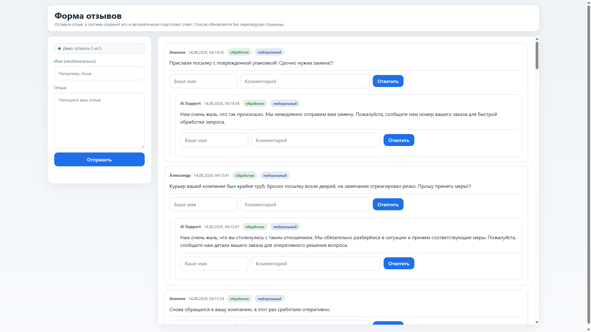
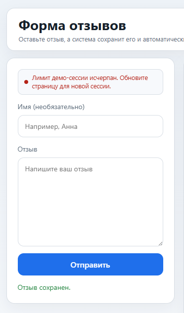
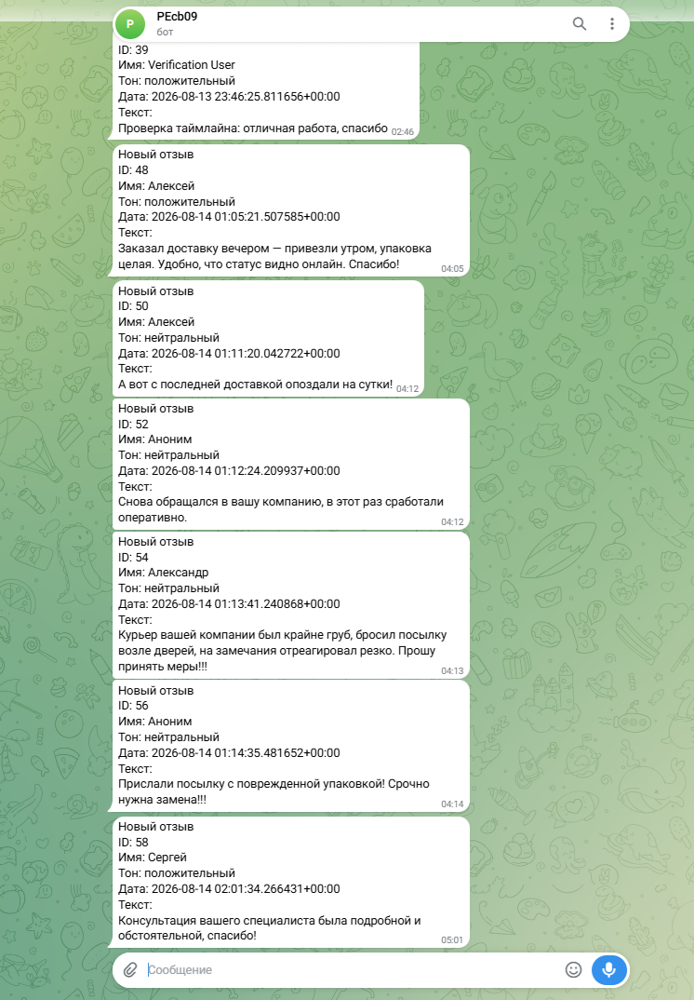

# 📖 Review Auto Responder — руководство пользователя сайта

**Проект:** review-auto-responder
**Дата:** 2026-08-14

🌐 **Живое демо:** [▶️ Открыть сайт отзывов](https://review-auto-responder.alex-n8n.site)

Это руководство для посетителя публичного сайта отзывов. Операторская панель
`/admin` описана отдельно — см. [🚀 DEPLOYMENT_GUIDE.md §5](DEPLOYMENT_GUIDE.md).

---

## 🎯 1. Что это

Публичный сайт, где клиенты оставляют отзывы. За страницей работает автономный
ассистент: как только появляется новый отзыв, ассистент сам определяет его
тональность (позитив / негатив / нейтраль) и за несколько секунд публикует ответ
от лица компании прямо в той же ветке обсуждения. Параллельно он отправляет
оператору уведомление в Telegram — чтобы человек успел подключиться к негативу,
где автоматический ответ не решает вопрос.

От вас как посетителя не требуется ничего, кроме текста отзыва — регистрация
не нужна.

---

## ✍️ 2. Как оставить отзыв

1. Откройте [сайт отзывов](https://review-auto-responder.alex-n8n.site).
2. В левой форме укажите имя (необязательно) и текст отзыва.
3. Нажмите «Отправить».
4. Отзыв сразу появляется в списке справа — страница обновляется без перезагрузки.

> 📌 Поле имени необязательно. Если оставить пустым — отзыв опубликуется от
> имени «Гость». Текст обязателен.

---

## 🏷️ 3. Демо-квота — что значит бейдж

Над формой показывается бейдж **«Демо: осталось N из 5»**. Это квота публикаций
на одну сессию: каждый отправленный отзыв запускает генерацию ответа нейросетью,
 поэтому число публикаций ограничено, чтобы публичное демо не расходовалось
безлимитно.

- При входе на сайт вы получаете короткоживущий демо-токен (хранится в браузере).
- Каждый отправленный отзыв списывает одну публикацию из квоты — бейдж
  уменьшается (`5 → 4 → … → 0`).
- Обновление страницы = новая сессия = новая квота (5 публикаций).

> 📌 Квота считается на backend'е — интерфейс лишь отображает реальное
> состояние. Смена IP квоту не сбрасывает.

---

## 🤖 4. Ответ ИИ в треде

Через несколько секунд после отправки (в пределах цикла опроса воркера) под
вашим отзывом появляется ответ от **AI Support** — ассистент определил тон и
сгенерировал уместный ответ. Бейдж квоты при этом уменьшается на единицу.

Ответ публикуется как дочерний комментарий в той же ветке — структура
обсуждения сохраняется, и видно, на какой отзыв отвечали.

> 📌 Система не падает без нейросети: при сбое или отсутствии провайдера
> ассистент отвечает заготовленным шаблоном по тону — отзыв не останется без
> реакции.

---

## 🚫 5. Исчерпание квоты

Когда квота сессии закончилась (бейдж дошёл до 0), форма блокируется и
появляется сообщение: **«Лимит демо-сессии исчерпан. Обновите страницу для
новой сессии.»**

Чтобы продолжить — обновите страницу: начнётся новая сессия с новой квотой
в 5 публикаций. Это нормальное поведение публичного демо, не ошибка.

---

## 📣 6. Уведомление оператора в Telegram

Параллельно с ответом на сайте ассистент отправляет оператору в Telegram
короткое сообщение: текст отзыва и определённую тональность. Оператор
мгновенно видит негатив и может подключиться лично там, где автономный
AI-ответ вопрос не решает (например, товар доставлен повреждённым).

> 📌 Уведомление опционально и зависит от настройки оператора — на публичном
> демо оно включено. Посетитель сайта этого канала не видит.

---

## ⚠️ 7. Ограничения

Сайт отзывов и автономный ассистент **не** делают:

- не редактируют и не удаляют уже опубликованные отзывы;
- не отвечают на собственные ответы (защита от бесконечного цикла автоответов);
- не передают персональные данные оператору сверх того, что вы написали в отзыве;
- не гарантируют ответ нейросетью при её недоступности — срабатывает словарный
  fallback по тону.

---

## ❓ 8. Частые вопросы

**Можно ли ответить на чужой отзыв?** Да — форма позволяет создать комментарий
к существующему отзыву (дочерний в треде).

**Почему ответ ИИ появился не мгновенно?** Воркер опрашивает сайт с
фиксированным интервалом; ответ публикуется в пределах одного цикла опроса
плюс время генерации (обычно несколько секунд).

**Квота обнулилась слишком быстро.** Это защита публичного демо. Обновите
страницу — новая сессия даст ещё 5 публикаций.

---

## 📚 Связанные документы

- [🏠 `README.md`](../README.md) — главная страница проекта.
- [🎬 `docs/SYSTEM_DEMO.md`](SYSTEM_DEMO.md) — скриншот-тур по всей системе.
- [🛡️ `docs/SECURITY_NOTES.md`](SECURITY_NOTES.md) — безопасность и демо-квота (технически).
- [🚀 `docs/DEPLOYMENT_GUIDE.md`](DEPLOYMENT_GUIDE.md) — развёртывание и операторская панель.